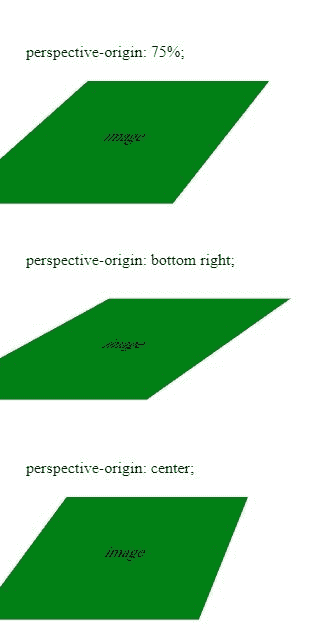

# CSS 透视-原点属性

> 原文:[https://www . geesforgeks . org/CSS-perspective-origin-property/](https://www.geeksforgeeks.org/css-perspective-origin-property/)

CSS 中的透视原点属性用于定义用户查看 3D 对象的位置，即 3D 对象的消失点。

**语法:**

```html
perspective-origin: x-axis y-axis|initial|inherit;
```

**属性值:**

*   **x 轴:**表示透视原点的水平位置。x 轴的可能值如下所示:
    *   **百分比(%):** 用百分比设置 x 轴。
    *   **长度:**定义 x 轴的长度。
    *   **左侧:**设置 x 轴左侧位置。
    *   **cente:** 设置 x 轴的位置中心。
    *   **右:**我把 x 轴的位置设置对了。
*   **y 轴:**表示透视原点的垂直位置。y 轴的可能值如下所示:
    *   **百分比(%):** 用百分比来设定 y 轴的位置。
    *   **长度:**根据长度设置位置。
    *   **顶部:**设置 y 轴的顶部位置。
    *   **中心:**设置 y 轴的中心位置。
    *   **底部:**设置 y 轴的底部位置。
*   **初始值:**将透视原点属性设置为默认值。
*   **继承:**透视原点属性从其父属性继承。

**示例:**

```html
<!DOCTYPE html>
<html>

<head>
    <title>
        CSS perspective-origin Property
    </title>

    <style>
        .container1 {
            padding: 20px;
            perspective: 100px; 
            perspective-origin: 75%;

            /* For Safari Browsers */
            -webkit-perspective: 100px;
            -webkit-perspective-origin: 75%;
        }
        .container2 {
            padding: 20px;
            perspective: 100px; 
            perspective-origin: bottom right;

            /* For Safari Browsers */
            -webkit-perspective: 100px;
            -webkit-perspective-origin: bottom right;
        }
        .container3 {
            padding: 20px;
            perspective: 100px; 
            perspective-origin: center;

            /* For Safari Browsers */
            -webkit-perspective: 100px;
            -webkit-perspective-origin: center;
        }
        .rotate {
            width: 100px;
            padding: 50px;
            text-align: center;
            background: green;
            transform: rotateX(10deg);
        }
    </style>
</head>

<body>
    <div class = "container1">

        <p>perspective-origin: 75%;</p>

        <div class = "rotate">image</div>

    </div>

    <div class = "container2">

        <p>perspective-origin: bottom right;</p>

        <div class = "rotate">image</div>

    </div>

    <div class = "container3">

        <p>perspective-origin: center;</p>

        <div class = "rotate">image</div>

    </div>
</body>

</html>                                
```

**输出:**


**支持的浏览器:***透视原点属性*支持的浏览器如下:

*   谷歌 Chrome36.0，12.0 -webkit-
*   Apple Safari 9.0，4.0.3 -webkit-)
*   火狐浏览器 16.0， 10.0 -moz-
*   Opera 23.0，15.0 -webkit-
*   Internet Explorer 10.0