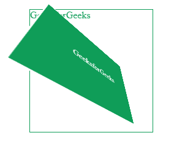
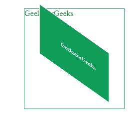
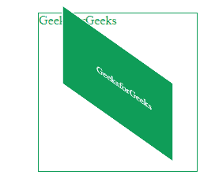
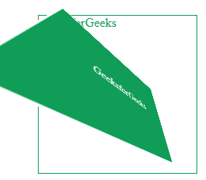

# CSS 透视属性

> 原文:[https://www.geeksforgeeks.org/css-perspective-property/](https://www.geeksforgeeks.org/css-perspective-property/)

CSS **透视** **属性**用于给 3D 对象赋予透视效果。透视是三维物体在 2D 平面上的表现形式，以给出相对于彼此的外观深度和距离。定义透视属性时，子元素获得透视，而不是父元素。因此，该值定义了孩子离 Z 平面有多近。

如果 z 大于 0，每个三维元素都会变大&如果 z 小于 0，每个三维元素都会变小。效果的强度可以由透视属性值决定。视角的大值可以产生小的转换&视角的小值可以产生大的转换。用户后面的 3D 元素部分，即如果它们的 z 轴坐标大于透视 CSS 属性值，则不可能绘制。默认情况下，淡入淡出点位于元素的中心位置，尽管我们可以使用[透视原点](https://www.geeksforgeeks.org/css-perspective-origin-property/)属性更改其位置。通过使用除了*以外没有*值的透视属性，可以创建新的[堆叠上下文](https://www.geeksforgeeks.org/describe-z-index-and-how-a-stacking-context-is-formed-in-css/)。

**语法:**

```css
perspective: length| none| initial| inherit;
```

**属性值:**下面的例子很好地描述了所有的属性。

[**长度**](https://www.geeksforgeeks.org/css-length-data-type/) **:** 长度属性用于设置子元素从查看器到 Z 平面的距离。所以，价值越小，形成的形象就越辉煌。

**语法:**

```css
perspective: length;
```

**示例:**此示例说明了**透视** **属性**的使用，其中长度值设置为 200px。

## 超文本标记语言

```css
<!DOCTYPE html>
<html>
<head>
    <title> CSS | perspective Property </title>
    <style>
    .class1 {
        margin-top: 20px;
        margin-left: 40px;
        height: 200px;
        width: 200px;
        color: #0F9D58;
        border: 1px solid;
        perspective: 200px; /*length value of perspective property*/
    }

    .class2 {
        padding: 60px;
        border: 2px solid;
        background: #0F9D58;
        color: white;
        transform: rotateX(45deg) rotateY(45deg);
    }
    </style>
</head>

<body>
    <div class="class1">GeeksforGeeks
        <div class="class2">GeeksforGeeks</div>
    </div>
</body>
</html>
```

**输出:**



**无:**为默认值。它表示没有设置透视。无相当于 0px。

**语法:**

```css
perspective: none;
```

**示例:**此示例说明了**透视** **属性**的使用，其中属性值设置为无。

## 超文本标记语言

```css
<!DOCTYPE html>
<html>
<head>
    <title> CSS | perspective Property </title>
    <style>
    .class1 {
        margin-top: 20px;
        margin-left: 40px;
        height: 200px;
        width: 200px;
        color: #0F9D58;
        border: 1px solid;

        /*none value of perspective property*/
        perspective: none;
    }

    .class2 {
        padding: 60px;
        border: 2px solid;
        background: #0F9D58;
        color: white;
        transform: rotateX(45deg) rotateY(45deg);
    }
    </style>
</head>

<body>
    <div class="class1">GeeksforGeeks
        <div class="class2">GeeksforGeeks</div>
    </div>
</body>
</html>
```

**输出:**



[**【初始】**](https://www.geeksforgeeks.org/css-value-initial/) **:** 用于将元素的 CSS 属性设置为默认值，即初始设置默认值。没有设定视角。

**语法:**

```css
perspective: initial;
```

**示例:**此示例说明了使用**透视** **属性**，其中属性值设置为初始值。

## 超文本标记语言

```css
<!DOCTYPE html>
<html>
<head>
    <title> CSS | perspective Property </title>
    <style>
    .class1 {
        margin-top: 20px;
        margin-left: 40px;
        height: 200px;
        width: 200px;
        color: #0F9D58;
        border: 1px solid;

        /*initial value of perspective property*/
        perspective: initial;
    }

    .class2 {
        padding: 60px;
        border: 2px solid;
        background: #0F9D58;
        color: white;
        transform: rotateX(45deg) rotateY(45deg);
    }
    </style>
</head>

<body>
    <div class="class1">GeeksforGeeks
        <div class="class2">GeeksforGeeks</div>
    </div>
</body>
</html>
```

**输出:**



[**继承**](https://www.geeksforgeeks.org/css-value-inherit/) **:** 用于从元素的父元素属性值 ie 继承元素的属性。，inherit 从父元素接收属性。当它与根元素一起使用时，将使用初始属性。

**语法:**

```css
perspective: inherit;
```

**示例:**该示例说明了**视角** **属性**的使用，其中属性值被设置为继承。

## 超文本标记语言

```css
<!DOCTYPE html>
<html>
<head>
    <title> CSS | perspective Property </title>
    <style>
    .class0 {
        perspective: 150px;
    }

    .class1 {
        margin-top: 20px;
        margin-left: 40px;
        height: 200px;
        width: 200px;
        color: #0F9D58;
        border: 1px solid;

        /*inherit value of perspective property*/
        perspective: inherit;
    }

    .class2 {
        padding: 60px;
        border: 2px solid;
        background: #0F9D58;
        color: white;
        transform: rotateX(45deg) rotateY(45deg);
    }
    </style>
</head>

<body>
    <div class="class0">
        <div class="class1">GeeksforGeeks
            <div class="class2">GeeksforGeeks</div>
        </div>
    </div>
</body>
</html>
```

**输出:**



**支持的浏览器:***透视属性*支持的浏览器如下:

*   谷歌 Chrome 36.0
*   Internet Explorer 10.0
*   微软边缘 12.0
*   Firefox 16.0
*   Opera 23.0
*   Safari 9.0