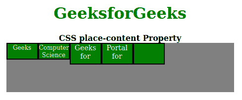

# CSS 位置-内容属性

> 原文:[https://www.geeksforgeeks.org/css-place-content-property/](https://www.geeksforgeeks.org/css-place-content-property/)

**CSS place-content** 属性是 [**align-content**](https://www.geeksforgeeks.org/css-align-content-property/) 和[**align-content**](https://www.geeksforgeeks.org/css-justify-content-property/)属性的简写。CSS 中的简写属性意味着您可以在单个属性中设置多个属性值。这里，place-content 属性可以保存 align-content 和 align-content 属性值。

**语法:**

```
place-content: align-content-property-value justify-content-property-value
```

**属性值:**该属性接受由对齐内容和对齐内容属性值组成的所有可能的组合值。

*   **开始:**该属性用于从容器开始对齐伸缩项。
*   **end:** 该属性用于从容器末端对齐伸缩项。
*   **flex-start:** 该属性显示 flex 容器开始处的行。
*   **伸缩端:**该属性显示伸缩容器末端的伸缩线。
*   **居中:**该属性将伸缩项对齐容器的中心。
*   **环绕空间:**该属性在挠曲线周围平均分配空间。
*   **间距:**该属性以相等的间距分布挠曲线空间。
*   **间距均匀:**该属性定义了它们之间间距相等但与角的间距不同的位置。
*   **拉伸:**该属性定义拉伸的线，以占据伸缩容器的剩余空间。这是默认值。

以下示例说明了 CSS 位置内容属性:

**示例 1:** 在本例中，我们将使用以下地点内容属性值: **flex-start center。**

## 超文本标记语言

```
<!DOCTYPE html>
<html>
    <head>
        <title>CSS place-content Property</title>
        <style>
            h1 {
                color: green;
            }
            #container {
                display: flex;
                height: 200px;
                width: 460px;
                flex-wrap: wrap;
                background-color: gray;
                /* Setting property values */
                place-content: flex-start center;
            }

            div > div {
                border: 2px solid black;
                width: 60px;
                background-color: green;
                color: white;
            }

            .short {
                font-size: 12px;
                height: 30px;
            }

            .tall {
                font-size: 14px;
                height: 40px;
            }
        </style>
    </head>
    <body>
        <center>
            <h1>GeeksforGeeks</h1>
            <b>CSS place-content Property</b>
            <div id="container">
                <div class="short">Geeks</div>
                <div class="short">
                    Computer<br />
                    Science
                </div>
                <div class="tall">
                    Geeks<br />
                    for
                </div>
                <div class="tall">
                    Portal<br />
                    for
                </div>
                <div class="tall"></div>
            </div>
        </center>
    </body>
</html>
```

**输出:**


**示例 2:** 这里我们将使用**place-content:flex-start**属性值。

## 超文本标记语言

```
<!DOCTYPE html>
<html>
    <head>
        <title>CSS place-content Property</title>
        <style>
            h1 {
                color: green;
            }
            #container {
                display: flex;
                height: 100px;
                width: 460px;
                flex-wrap: wrap;
                background-color: gray;

                /* place-content can be changed
                   in the live sample */
                place-content: flex-start start;
            }

            div > div {
                border: 2px solid black;
                width: 60px;
                background-color: green;
                color: white;
            }

            .short {
                font-size: 12px;
                height: 30px;
            }

            .tall {
                font-size: 14px;
                height: 40px;
            }
        </style>
    </head>

    <body>
        <center>
            <h1>GeeksforGeeks</h1>
            <b>CSS place-content Property</b>
            <div id="container">
                <div class="short">Geeks</div>
                <div class="short">
                    Computer<br />
                    Science
                </div>
                <div class="tall">
                    Geeks<br />
                    for
                </div>
                <div class="tall">
                    Portal<br />
                    for
                </div>
                <div class="tall"></div>
            </div>
        </center>
    </body>
</html>
```

**输出:**



**示例 3:** 这里我们将使用**place-content:flex-end**属性值。

## 超文本标记语言

```
<!DOCTYPE html>
<html>
    <head>
        <title>CSS place-content Property</title>
        <style>
            h1 {
                color: green;
            }
            #container {
                display: flex;
                height: 100px;
                width: 460px;
                flex-wrap: wrap;
                background-color: gray;

                /* place-content can be 
                  changed in the live sample */
                place-content: flex-end end;
            }

            div > div {
                border: 2px solid black;
                width: 60px;
                background-color: green;
                color: white;
            }

            .short {
                font-size: 12px;
                height: 30px;
            }

            .tall {
                font-size: 14px;
                height: 40px;
            }
        </style>
    </head>
    <body>
        <center>
            <h1>GeeksforGeeks</h1>
            <b>CSS place-content Property</b>
            <div id="container">
                <div class="short">Geeks</div>
                <div class="short">
                    Computer<br />
                    Science
                </div>
                <div class="tall">
                    Geeks<br />
                    for
                </div>
                <div class="tall">
                    Portal<br />
                    for
                </div>
                <div class="tall"></div>
            </div>
        </center>
    </body>
</html>
```

**输出:**


**支持的浏览器:**

*   Firefox(最佳支持)
*   铬
*   旅行队
*   歌剧
*   边缘