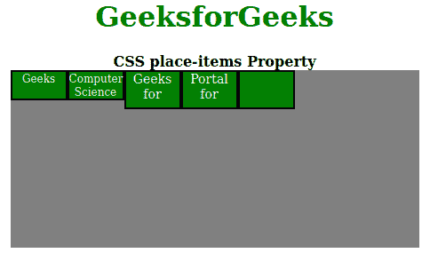
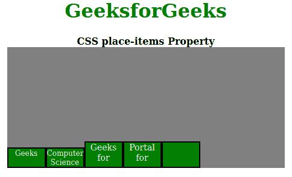

# CSS 放置物品属性

> 原文:[https://www.geeksforgeeks.org/css-place-items-property/](https://www.geeksforgeeks.org/css-place-items-property/)

**CSS place-items** 属性是 [**align-items**](https://www.geeksforgeeks.org/css-align-items-property/) 和**align-items**属性的简写。在 CSS 中，简写属性意味着您可以在单个属性中设置多个属性值。所以在这里，place-items 属性可以保存 align-items 属性值和 align-items 属性值。

**语法:**

```html
place-items: align-items property value justify-items property value

```

**属性值:**该属性接受对齐项和对齐项属性值的所有可能组合值。

*   **自动:**如果项目没有父项目，则使用该属性定义绝对定位。
*   **正常:**这个属性取决于我们所处的布局模式。
*   **开始:**该属性用于从容器开始对齐伸缩项。
*   **end:** 此属性用于从容器的末端对齐伸缩项。
*   **flex-start:** 该属性显示 flex 容器开始处的行。
*   **伸缩端:**该属性显示伸缩容器末端的伸缩线。
*   **居中:**该属性将伸缩项对齐容器的中心。
*   **自启动:**该属性将与项目起始侧的对齐容器边缘齐平包装。
*   **自端:**该属性将与物品端侧的对齐容器边缘齐平包装。
*   **间距均匀:**该属性定义了它们之间的间距相等，但与角的间距不同。
*   **拉伸:**该属性定义拉伸的线占据伸缩容器的剩余空间。这是默认值。

以下示例说明了 CSS 放置项属性:

**示例 1:** 在本例中，我们将使用星型 place-items: flex-start 属性值。

## 超文本标记语言

```html
<!DOCTYPE html>
<html>
    <head>
        <title>CSS place-items Property</title>
        <style>
            h1 {
                color: green;
            }
            #container {
                display: flex;
                height: 200px;
                width: 460px;
                flex-wrap: wrap;
                background-color: gray;
                /* place-items can be changed in the live sample */
                place-items: flex-start;
            }

            div > div {
                border: 2px solid black;
                width: 60px;
                background-color: green;
                color: white;
            }

            .short {
                font-size: 12px;
                height: 30px;
            }

            .tall {
                font-size: 14px;
                height: 40px;
            }
        </style>
    </head>
    <body>
        <center>
            <h1>GeeksforGeeks</h1>
            <b>CSS place-items Property</b>
            <div id="container">
                <div class="short">Geeks</div>
                <div class="short">
                    Computer<br />
                    Science
                </div>
                <div class="tall">
                    Geeks<br />
                    for
                </div>
                <div class="tall">
                    Portal<br />
                    for
                </div>
                <div class="tall"></div>
            </div>
        </center>
    </body>
</html>
```

**输出:**

[](https://media.geeksforgeeks.org/wp-content/uploads/20200808201931/Screenshotfrom20200808201543.png)

**示例 2:** 这里我们将使用 place-items: flex-end 属性值。

## 超文本标记语言

```html
<!DOCTYPE html>
<html>
    <head>
        <title>CSS place-content Property</title>
        <style>
            h1 {
                color: green;
            }
            #container {
                display: flex;
                height: 200px;
                width: 460px;
                flex-wrap: wrap;
                background-color: gray;
                /* place-items can be changed in the live sample */
                place-items: flex-end;
            }

            div > div {
                border: 2px solid black;
                width: 60px;
                background-color: green;
                color: white;
            }

            .short {
                font-size: 12px;
                height: 30px;
            }

            .tall {
                font-size: 14px;
                height: 40px;
            }
        </style>
    </head>
    <body>
        <center>
            <h1>GeeksforGeeks</h1>
            <b>CSS place-items Property</b>
            <div id="container">
                <div class="short">Geeks</div>
                <div class="short">
                    Computer<br />
                    Science
                </div>
                <div class="tall">
                    Geeks<br />
                    for
                </div>
                <div class="tall">
                    Portal<br />
                    for
                </div>
                <div class="tall"></div>
            </div>
        </center>
    </body>
</html>
```

**输出:**

