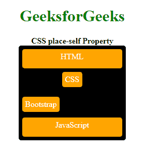
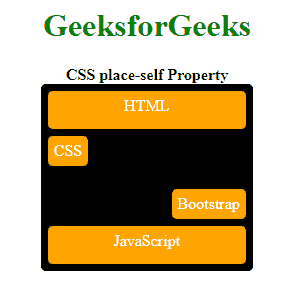

# CSS 放置自属性

> 原文:[https://www.geeksforgeeks.org/css-place-self-property/](https://www.geeksforgeeks.org/css-place-self-property/)

**CSS place-self** 属性是 **align-self** 和**align-self**属性的简写。CSS 中的简写属性意味着您可以在单个属性中设置多个属性值。在这里，自定位属性可以保存自对齐和自对齐属性的值。

**语法:**

```html
place-self: align-self-property-value justify-self-property-value
```

**属性值:**该属性接受对齐项和对齐项属性值的所有可能组合值。

*   **自动:**如果项目没有父项目，则使用该属性。然后，该属性用于定义项目的绝对位置。
*   **正常:**该属性取决于当前布局模式。
*   **开始:**该属性用于从容器开始对齐伸缩项。
*   **end:** 该属性用于从容器末端对齐伸缩项。
*   **flex-start:** 该属性用于显示 flex 容器开始处的行。
*   **flex-end:** 该属性用于显示 flex 容器末端的 flex 线。
*   **中心:**该属性用于将伸缩项与容器中心对齐。
*   **自启动:**该属性用于将物品与物品的起始侧齐平地包装到对齐容器中。
*   **自端:**该属性用于将物品与物品的端侧齐平地包装到对齐容器中。
*   **间距均匀:**该属性定义了它们之间间距相等但与角的间距不同的位置。
*   **拉伸:**该属性定义拉伸的线，以占据伸缩容器的剩余空间。这是默认值。

下面的例子说明了 **CSS place-self** 属性:

**例 1:**

## 超文本标记语言

```html
<!DOCTYPE html>
<html>

<head>
    <title>CSS place-self Property</title>
    <style>
        h1 {
            color: green;
        }

        article {
            background-color: black;
            display: grid;
            grid-auto-rows: 40px;
            grid-gap: 5px;
            width: 200px;
        }

        /* Using different values
    with the place-self property */
        span:nth-child(2) {
            place-self: start center;
        }

        span:nth-child(3) {
            place-self: center start;
        }

        article span {
            background-color: orange;
            color: white;
            margin: 1px;
            text-align: center;
        }

        article,
        span {
            padding: 6px;
            border-radius: 5px;
        }
    </style>
</head>

<body>
    <center>
        <h1>GeeksforGeeks</h1>
        <b>CSS place-self Property</b>
        <article class="container">
            <span>HTML</span>
            <span>CSS</span>
            <span>Bootstrap</span>
            <span>JavaScript</span>
        </article>
    </center>
</body>

</html>
```

**输出:**


**例 2:**

## 超文本标记语言

```html
<!DOCTYPE html>
<html>

<head>
    <title>CSS place-self Property</title>
    <style>
        h1 {
            color: green;
        }

        article {
            background-color: black;
            display: grid;
            grid-auto-rows: 40px;
            grid-gap: 5px;
            width: 200px;
        }

        /* Using different values
        with the place-self property */
        span:nth-child(2) {
            place-self: self-start;
        }

        span:nth-child(3) {
            place-self: self-end;
        }

        article span {
            background-color: orange;
            color: white;
            margin: 1px;
            text-align: center;
        }

        article,
        span {
            padding: 6px;
            border-radius: 5px;
        }
    </style>
</head>

<body>
    <center>
        <h1>GeeksforGeeks</h1>
        <b>CSS place-self Property</b>
        <article class="container">
            <span>HTML</span>
            <span>CSS</span>
            <span>Bootstrap</span>
            <span>JavaScript</span>
        </article>
    </center>
</body>

</html>
```

**Output:**
