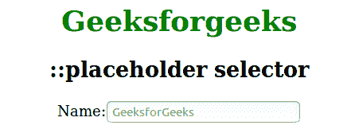
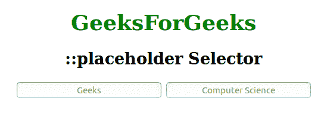

# CSS::占位符选择器

> 原文:[https://www.geeksforgeeks.org/css-placeholder-selector/](https://www.geeksforgeeks.org/css-placeholder-selector/)

CSS [伪元素](https://www.geeksforgeeks.org/css-pseudo-elements/)中的**占位符选择器**用于通过更改文本颜色来设计占位符文本，并允许修改文本的样式。

::第一行伪元素是 CSS 属性中唯一适用的子集&可以在其选择器中使用::占位符在规则中应用。默认情况下，大多数浏览器的占位符文本外观为半透明或浅灰色。

**语法:**

```
::placeholder {
    // CSS property
}
```

我们将通过例子理解**的概念:占位符选择器** &及其实现。

**示例 1:** 本示例说明了用于更改文本颜色以及占位符文本的背景颜色的**::占位符选择器**。

## 超文本标记语言

```
<!DOCTYPE html>
<html>
<head>
    <title>::placeholder selector</title>
    <style>
    input::placeholder {
        background-color: #fff;
        margin: 10px;
        padding: 5px;
        color: Green;
    }

    h1 {
        color: green;
    }

    body {
        text-align: center;
    }
    </style>
</head>

<body>
    <h1>Geeksforgeeks</h1>
    <h2>::placeholder selector</h2>
    <p>Name:
        <input placeholder="GeeksforGeeks">
    </p>

</body>
</html>
```

**输出:**



**示例 2:** 本示例说明了**::占位符选择器**，用于设置占位符文本，其属性标识描述输入字段预期值的提示。

## 超文本标记语言

```
<!DOCTYPE html>
<html>
<head>
    <title>::placeholder selector</title>
    <style>
    h1 {
        color: green;
    }

    body {
        text-align: center
    }

    input::placeholder {
        background-color: white;
        color: green;
        text-align: center;
    }
    </style>
</head>

<body>
    <h1>GeeksForGeeks</h1>
    <h2>::placeholder Selector </h2>
    <input type="text" 
           placeholder="Geeks">
    <input type="text" 
           placeholder="Computer Science"> 
</body>
</html>
```

**输出:**



**支持的浏览器:**以下列出了::占位符选择器支持的浏览器:

*   谷歌 Chrome 57.0，4.0 -webkit-
*   Microsoft Edge 12.0 -webkit-，10.0 -ms-
*   火狐 51.0， 4.0 -moz-
*   Safari 10.1，5.0 -webkit-
*   Opera 44.0，15.0 -webkit-