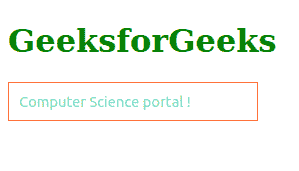
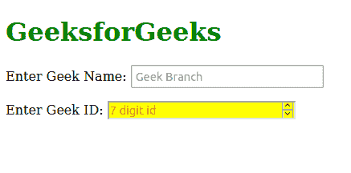

# CSS:占位符显示选择器

> 原文:[https://www . geesforgeks . org/CSS-占位符-显示-选择器/](https://www.geeksforgeeks.org/css-placeholder-shown-selector/)

CSS *:占位符显示的*伪类选择具有占位符文本的输入元素或文本区域元素。*:占位符显示*和*:占位符*的主要区别在于*:占位符显示*是在显示占位符文本时选择输入本身，而*:占位符*是给占位符文本赋予风格。

**语法:**

```
:placeholder-shown
{
   /* CSS Property */ 
}

```

**示例 1:** 以下是说明使用*:占位符显示的*属性的示例。

## 超文本标记语言

```
<!DOCTYPE html>
<html>

<head>
    <style>
        input {
            border: 1px solid black;
            padding: 10px;
        }

        input:placeholder-shown {
            border-color: rgb(255, 114, 58);
            color: rgb(24, 187, 97);
        }
    </style>
</head>

<body>

    <h1 style="color: green;">GeeksforGeeks</h1>
    <input placeholder="Computer Science portal !">
</body>

</html>
```

**输出:**



**示例 2:** 以下是说明使用*:占位符显示的*属性的示例。

## 超文本标记语言

```
<!DOCTYPE html>
<html lang="en">

<head>
    <style>
        input.studentid:placeholder-shown {
            background-color: yellow;
            color: red;
        }
    </style>
</head>

<body>
    <h1 style="color: green;">GeeksforGeeks</h1>

    <form>
        <p>
            <label for="branch">Enter Geek Name:</label>
            <input id="branch" placeholder="Geek Branch" />
        </p>

        <p>
            <label>Enter Geek ID:</label>
            <input type="number" pattern="[0-9]{7}" 
            class="studentid" placeholder="7 digit id" />
        </p>
    </form>
</body>

</html>
```

**输出:**



**支持的浏览器:**

*   铬
*   火狐浏览器
*   旅行队
*   歌剧
*   边缘
*   互联网浏览器(不支持)。