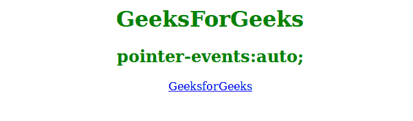
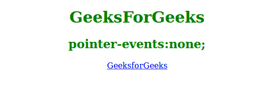

# CSS |指针事件属性

> 原文:[https://www.geeksforgeeks.org/css-pointer-events-property/](https://www.geeksforgeeks.org/css-pointer-events-property/)

此属性用于指定元素是否显示给指针事件，以及是否在指针上显示。

**语法:**

```css
pointer-events: auto|none;
```

**默认值:自动**

**属性值:**

**auto:** 此属性用于指定元素必须对指针事件做出反应。
**语法:**

```css
pointer-events:auto;
```

**示例:**

## 超文本标记语言

```css
<!DOCTYPE html>
<html>
    <head>
        <title>
            CSS | pointer-events Property
        </title>
        <style>
            p.geeks {
                pointer-events: auto;
            }
            h1, h2 {
                color:green;
            }
            body {
                text-align:center;
            }
        </style>
    </head>
    <body>
    <CENTER>
    <h1>GeeksForGeeks</h1>
    <h2>pointer-events:auto;</h2>
    <p class="geeks"><a href="#">GeeksforGeeks</p>

</A>
    </body>
</html>                   
```

**输出:**



**无:**该属性用于指定元素不对指针事件做出反应。
**语法:**

```css
pointer-events:none;
```

**示例:**

## 超文本标记语言

```css
<!DOCTYPE html>
<html>
    <head>
        <title>
            CSS | pointer-events Property
        </title>
        <style>
            p.geeks {
                pointer-events: none;
            }
            h1, h2 {
                color:green;
            }
            body {
                text-align:center;
            }
        </style>
    </head>
    <body>
        <h1>GeeksForGeeks</h1>
        <h2>pointer-events:none;</h2>
        <p class="geeks"><a href="#">GeeksforGeeks</p>

</a>
    </body>
</html>
```

**输出:**



**支持的浏览器:***指针事件属性*支持的浏览器如下:

*   谷歌 Chrome 2.0
*   Internet Explorer 11.0
*   Firefox 3.6
*   Opera 9.0
*   Safari 4.0