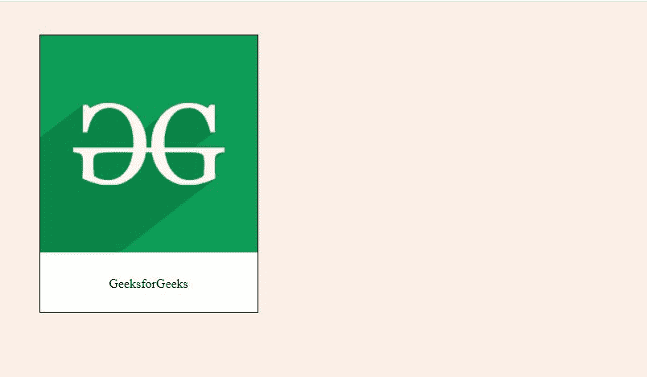
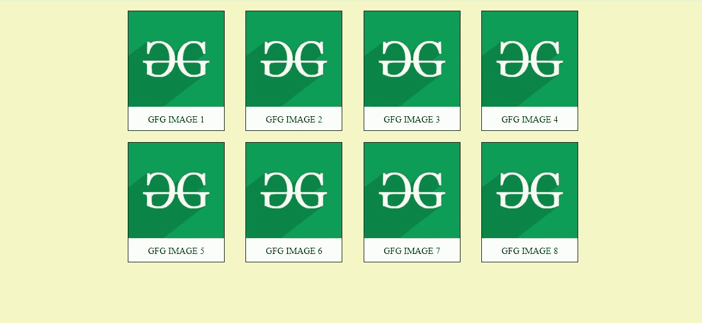

# CSS |宝丽来影像

> 原文:[https://www.geeksforgeeks.org/css-polaroid-images/](https://www.geeksforgeeks.org/css-polaroid-images/)

宝丽来图片是一个图片框，下方有一个标题。在本文中，您将学习使用 HTML 和 CSS 创建宝丽来图像。这可以通过使用 HTML[<>](https://www.geeksforgeeks.org/div-tag-html/)或 [<图>](https://www.geeksforgeeks.org/html5-figure-tag/) 标签来完成。

**1。使用 div:** 通过使用 HTML div 标签并添加 CSS 属性来创建偏光片图像，如下所示。将图像宽度设为 100%，使其与父图像一样宽。

```css
<!DOCTYPE html>
<html>

<head>
    <style>
        body {
            background-color: #faeee7;
        }

        .card {
            width: 20%;
            background-color: white;
            margin: 3%;
            border: 1px solid;
        }

        .card-txt {
            text-align: center;
            padding: 10px;
        }
    </style>

</head>

<body>
    <div class="card">
        
        <div class="card-txt">
            <p>GeeksforGeeks</p>
        </div>
    </div>
</body>

</html>
```

**输出:**


**2。使用图形和图形标题元素:**在以下示例中，使用 HTML5 图形标签创建了宝丽来图像。数字标签有一些默认的边距。一个盒子阴影被添加到它，这样它就可以将自己与背景隔离开来。

```css
<!DOCTYPE html>
<html>

<head>
    <style>
        figure {
            width: 20%;
            background-color: white;
            box-shadow: 5px 5px 5px #4d4d4e;
        }

        figcaption {
            text-align: center;
            padding: 10px 20px;
        }
    </style>
</head>

<body>
    <figure>
        
        <figcaption>
            <p>Computer Science</p>
        </figcaption>
    </figure>
</body>

</html>
```

**输出:**


**创建偏光片图库:**用户可以根据需要添加任意多的偏光片，创建图库。

**示例:**“*显示:flex* ”属性使图形排成一行，这通常会在单独的行上。默认情况下，画廊*分区*覆盖整个宽度。因此宽度被改变并且添加了“*边距:自动*”属性以使图库居中。“*对齐内容:*之间的空间”用于对齐图形并在它们之间创建相等的空间。“*折绕:折绕*”用于使图形折绕，并在排满时将项目移到下一排。

```css
<!DOCTYPE html>
<html>

<head>

    <style>
        body {
            background-color: #f4f7c5;
        }

        .gallery {
            display: flex;
            margin: auto;
            width: 800px;
            justify-content: space-between;
            flex-wrap: wrap;
        }

        figure {
            width: 170px;
            margin: 10px 0;
            background-color: white;
            border: 1px solid;
        }

        figcaption {
            text-align: center;
            padding: 10px;
        }
    </style>

</head>

<body>

    <div class="gallery">
        <figure>
            
            <figcaption>GFG IMAGE 1</figcaption>
        </figure>
        <figure>
            
            <figcaption>GFG IMAGE 2</figcaption>
        </figure>
        <figure>
            
            <figcaption>GFG IMAGE 3</figcaption>
        </figure>
        <figure>
            
            <figcaption>GFG IMAGE 4</figcaption>
        </figure>
        <figure>
            
            <figcaption>GFG IMAGE 5</figcaption>
        </figure>
        <figure>
            
            <figcaption>GFG IMAGE 6</figcaption>
        </figure>
        <figure>
            
            <figcaption>GFG IMAGE 7</figcaption>
        </figure>
        <figure>
            
            <figcaption>GFG IMAGE 8</figcaption>
        </figure>
    </div>

</body>

</html>
```

**输出:**
