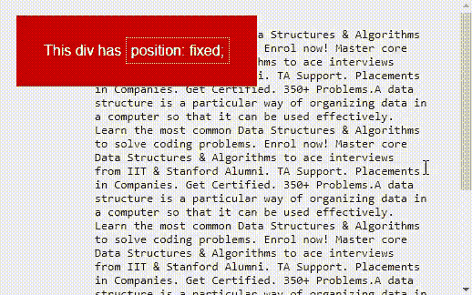
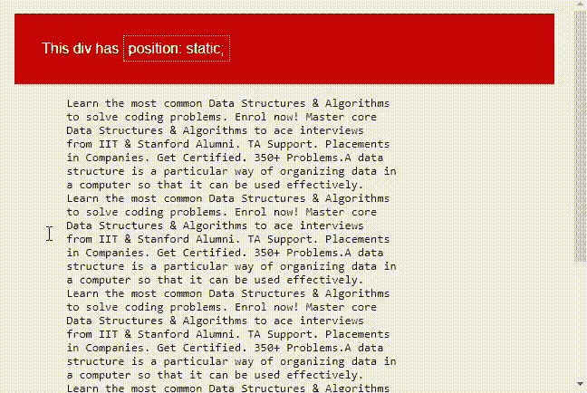
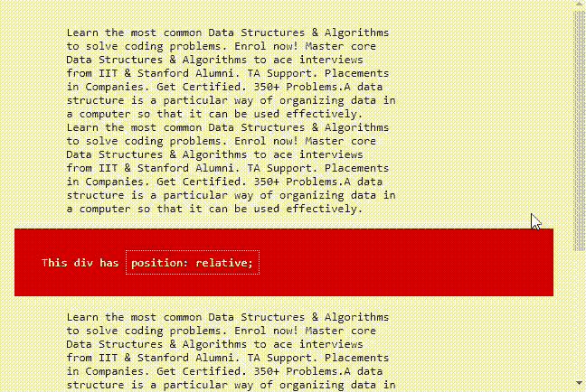
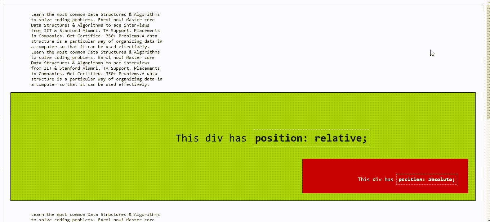
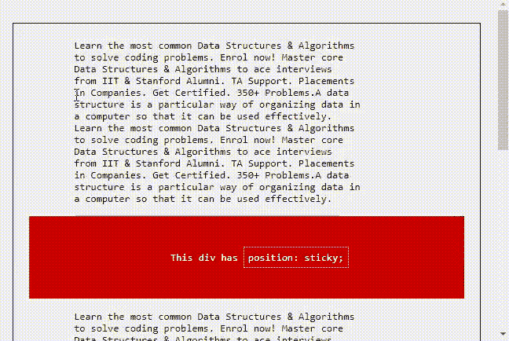

# CSS 定位元素

> 原文:[https://www.geeksforgeeks.org/css-positioning-elements/](https://www.geeksforgeeks.org/css-positioning-elements/)

CSS 中的**位置**属性讲述了元素或 HTML 实体的定位方法。CSS 中有五种不同类型的位置属性:

*   固定的；不变的
*   静态
*   亲戚
*   绝对的
*   粘的

元素的定位可以使用*顶部*、*右侧*、*底部*和*左侧*属性来完成。这些参数指定了 HTML 元素与视口边缘的距离。要通过这四个属性设置位置，我们必须声明定位方法。让我们详细了解这些定位方法:

**固定:**任何带有**位置的 HTML 元素:固定的**属性将相对于视口定位。具有固定位置的元素允许它保持在相同的位置，即使我们滚动页面。我们可以使用顶部、右侧、底部、左侧来设置元素的位置。

**示例:**下面的示例通过使用*位置:固定*属性来说明 CSS 定位元素。

## 超文本标记语言

```css
<!DOCTYPE html>
<html>

<head>
    <title> CSS Positioning Element</title>
    <style>
    body {
        margin: 0;
        padding: 20px;
        font-family: sans-serif;
        background: #efefef;
    }

    .fixed {
        position: fixed;
        background: #cc0000;
        color: #ffffff;
        padding: 30px;
        top: 50;
        left: 10;
    }

    span {
        padding: 5px;
        border: 1px #ffffff dotted;
    }
    </style>
</head>

<body>
    <div class="fixed">This div has
        <span>position: fixed;</span>
    </div>
    <pre>
            Learn the most common Data Structures & Algorithms
            to solve coding problems. Enrol now! Master core
            Data Structures & Algorithms to ace interviews
            from IIT & Stanford Alumni. TA Support. Placements
            in Companies. Get Certified. 350+ Problems.A data
            structure is a particular way of organizing data in
            a computer so that it can be used effectively.
            Learn the most common Data Structures & Algorithms
            to solve coding problems. Enrol now! Master core
            Data Structures & Algorithms to ace interviews
            from IIT & Stanford Alumni. TA Support. Placements
            in Companies. Get Certified. 350+ Problems.A data
            structure is a particular way of organizing data in
            a computer so that it can be used effectively.
            Learn the most common Data Structures & Algorithms
            to solve coding problems. Enrol now! Master core
            Data Structures & Algorithms to ace interviews
            from IIT & Stanford Alumni. TA Support. Placements
            in Companies. Get Certified. 350+ Problems.A data
            structure is a particular way of organizing data in
            a computer so that it can be used effectively.
            Learn the most common Data Structures & Algorithms
            to solve coding problems. Enrol now! Master core
            Data Structures & Algorithms to ace interviews
            from IIT & Stanford Alumni. TA Support. Placements
            in Companies. Get Certified. 350+ Problems.A data
            structure is a particular way of organizing data in
            a computer so that it can be used effectively.
    </pre>
</body>

</html>
```

**输出**:



**静态:**默认设置这种定位方式。如果我们不提及任何元素的定位方法，该元素默认具有**位置:** **静态**方法。通过定义静态，顶部、右侧、底部和左侧将无法控制元素。该元素将按照页面的正常流动进行定位。

**示例:**下面的示例通过使用*位置:静态*属性来说明 CSS 定位元素。

## 超文本标记语言

```css
<!DOCTYPE html>
<html>

<head>
    <title> CSS Positioning Element</title>
    <style>
    body {
        margin: 0;
        padding: 20px;
        font-family: sans-serif;
        background: #efefef;
    }

    .static {
        position: static;
        background: #cc0000;
        color: #ffffff;
        padding: 30px;
    }

    span {
        padding: 5px;
        border: 1px #ffffff dotted;
    }
    </style>
</head>

<body>
    <div class="static">
        This div has
            <span>position: static;</span>
    </div>
    <pre>
        Learn the most common Data Structures & Algorithms
        to solve coding problems. Enrol now! Master core
        Data Structures & Algorithms to ace interviews
        from IIT & Stanford Alumni. TA Support. Placements
        in Companies. Get Certified. 350+ Problems.A data
        structure is a particular way of organizing data in
        a computer so that it can be used effectively.
        Learn the most common Data Structures & Algorithms
        to solve coding problems. Enrol now! Master core
        Data Structures & Algorithms to ace interviews
        from IIT & Stanford Alumni. TA Support. Placements
        in Companies. Get Certified. 350+ Problems.A data
        structure is a particular way of organizing data in
        a computer so that it can be used effectively.
        Learn the most common Data Structures & Algorithms
        to solve coding problems. Enrol now! Master core
        Data Structures & Algorithms to ace interviews
        from IIT & Stanford Alumni. TA Support. Placements
        in Companies. Get Certified. 350+ Problems.A data
        structure is a particular way of organizing data in
        a computer so that it can be used effectively.
        Learn the most common Data Structures & Algorithms
        to solve coding problems. Enrol now! Master core
        Data Structures & Algorithms to ace interviews
        from IIT & Stanford Alumni. TA Support. Placements
        in Companies. Get Certified. 350+ Problems.A data
        structure is a particular way of organizing data in
        a computer so that it can be used effectively.
    </pre>
</body>

</html>
```

**输出**:



**相对:**一个具有**位置的元素:相对**与位于其顶部的其他元素相对定位。如果我们设置它的顶部、右侧、底部或左侧，其他元素将不会填充这个元素留下的间隙。

**示例:**下面的示例通过使用*位置:相对*属性来说明 CSS 定位元素。

## 超文本标记语言

```css
<!DOCTYPE html>
<html>

<head>
    <title> CSS Positioning Element</title>
    <style>
    body {
        margin: 0;
        padding: 20px;
        font-family: sans-serif;
        background: #efefef;
    }

    .relative {
        position: relative;
        background: #cc0000;
        color: #ffffff;
        padding: 30px;
    }

    span {
        padding: 5px;
        border: 1px #ffffff dotted;
    }
    </style>
</head>

<body>
    <pre>
        Learn the most common Data Structures & Algorithms
        to solve coding problems. Enrol now! Master core
        Data Structures & Algorithms to ace interviews
        from IIT & Stanford Alumni. TA Support. Placements
        in Companies. Get Certified. 350+ Problems.A data
        structure is a particular way of organizing data in
        a computer so that it can be used effectively.
        Learn the most common Data Structures & Algorithms
        to solve coding problems. Enrol now! Master core
        Data Structures & Algorithms to ace interviews
        from IIT & Stanford Alumni. TA Support. Placements
        in Companies. Get Certified. 350+ Problems.A data
        structure is a particular way of organizing data in
        a computer so that it can be used effectively.
        <div class="relative">
            This div has <span>position: relative;</span>
        </div>
        Learn the most common Data Structures & Algorithms
        to solve coding problems. Enrol now! Master core
        Data Structures & Algorithms to ace interviews
        from IIT & Stanford Alumni. TA Support. Placements
        in Companies. Get Certified. 350+ Problems.A data
        structure is a particular way of organizing data in
        a computer so that it can be used effectively.
        Learn the most common Data Structures & Algorithms
        to solve coding problems. Enrol now! Master core
        Data Structures & Algorithms to ace interviews
        from IIT & Stanford Alumni. TA Support. Placements
        in Companies. Get Certified. 350+ Problems.A data
        structure is a particular way of organizing data in
        a computer so that it can be used effectively.
    </pre>
</body>

</html>
```

**输出**:



**绝对:**具有**位置的元素:绝对**将相对于其父元素进行定位。这个元素的位置不依赖于它的兄弟或在同一层的元素。

**示例:**下面的示例通过使用*位置:绝对*属性来说明 CSS 定位元素。

## 超文本标记语言

```css
<!DOCTYPE html>
<html>

<head>
    <title> CSS Positioning Element</title>
    <style>
    body {
        margin: 0;
        padding: 20px;
        font-family: sans-serif;
        background: #efefef;
    }

    .absolute {
        position: absolute;
        background: #cc0000;
        color: #ffffff;
        padding: 30px;
        font-size: 15px;
        bottom: 20px;
        right: 20px;
    }

    .relative {
        position: relative;
        background: #aad000;
        height: 300px;
        font-size: 30px;
        border: 1px solid #121212;
        text-align: center;
    }

    span {
        padding: 5px;
        border: 1px #ffffff dotted;
    }

    pre {
        padding: 20px;
        border: 1px solid #000000;
    }
    </style>
</head>

<body>
     <pre>
        Learn the most common Data Structures & Algorithms
        to solve coding problems. Enrol now! Master core
        Data Structures & Algorithms to ace interviews
        from IIT & Stanford Alumni. TA Support. Placements
        in Companies. Get Certified. 350+ Problems.A data
        structure is a particular way of organizing data in
        a computer so that it can be used effectively.
        Learn the most common Data Structures & Algorithms
        to solve coding problems. Enrol now! Master core
        Data Structures & Algorithms to ace interviews
        from IIT & Stanford Alumni. TA Support. Placements
        in Companies. Get Certified. 350+ Problems.A data
        structure is a particular way of organizing data in
        a computer so that it can be used effectively.
                <div class="relative">
                    <div >
                        This div has
                        <span>
                            <strong>position: relative;</strong>
                        </span>
                    </div>
                    <div class="absolute">
                       This div has
                            <span>
                                <strong>position: absolute;</strong>
                            </span>
                    </div>
                </div>
        Learn the most common Data Structures & Algorithms
        to solve coding problems. Enrol now! Master core
        Data Structures & Algorithms to ace interviews
        from IIT & Stanford Alumni. TA Support. Placements
        in Companies. Get Certified. 350+ Problems.A data
        structure is a particular way of organizing data in
        a computer so that it can be used effectively.
        Learn the most common Data Structures & Algorithms
        to solve coding problems. Enrol now! Master core
        Data Structures & Algorithms to ace interviews
        from IIT & Stanford Alumni. TA Support. Placements
        in Companies. Get Certified. 350+ Problems.A data
        structure is a particular way of organizing data in
        a computer so that it can be used effectively.
        Learn the most common Data Structures & Algorithms
        to solve coding problems. Enrol now! Master core
        Data Structures & Algorithms to ace interviews
        from IIT & Stanford Alumni. TA Support. Placements
        in Companies. Get Certified. 350+ Problems.A data
        structure is a particular way of organizing data in
        a computer so that it can be used effectively.
        Learn the most common Data Structures & Algorithms
        to solve coding problems. Enrol now! Master core
        Data Structures & Algorithms to ace interviews
        from IIT & Stanford Alumni. TA Support. Placements
        in Companies. Get Certified. 350+ Problems.A data
        structure is a particular way of organizing data in
        a computer so that it can be used effectively.
        Learn the most common Data Structures & Algorithms
        to solve coding problems. Enrol now! Master core
        Data Structures & Algorithms to ace interviews
        from IIT & Stanford Alumni. TA Support. Placements
        in Companies. Get Certified. 350+ Problems.A data
        structure is a particular way of organizing data in
        a computer so that it can be used effectively.
    </pre>
</body>

</html>
```

**输出**:



**粘性:**元素带**位置:粘性**和**顶部:0** 根据放置的位置在**固定&相对**之间起作用。如果元素被放置在文档的中间，那么当用户滚动文档时，粘性元素开始滚动，直到它接触到顶部。当它接触顶部时，尽管进一步滚动，它仍将固定在该位置。我们可以把元素贴在底部，底部有**属性。**

**示例:**下面的示例通过使用*位置:粘性*属性来说明 CSS 定位元素。

## 超文本标记语言

```css
<!DOCTYPE html>
<html>

<head>
    <title> CSS Positioning Element</title>
    <style>
    body {
        margin: 0;
        padding: 20px;
        font-family: sans-serif;
        background: #efefef;
    }

    .sticky {
        position: sticky;
        background: #cc0000;
        color: #ffffff;
        padding: 30px;
        top: 10px;
        right: 50px;
    }

    span {
        padding: 5px;
        border: 1px #ffffff dotted;
    }

    pre {
        padding: 20px;
        border: 1px solid #000000;
    }
    </style>
</head>

<body>
    <pre>
        Learn the most common Data Structures & Algorithms
        to solve coding problems. Enrol now! Master core
        Data Structures & Algorithms to ace interviews
        from IIT & Stanford Alumni. TA Support. Placements
        in Companies. Get Certified. 350+ Problems.A data
        structure is a particular way of organizing data in
        a computer so that it can be used effectively.
        Learn the most common Data Structures & Algorithms
        to solve coding problems. Enrol now! Master core
        Data Structures & Algorithms to ace interviews
        from IIT & Stanford Alumni. TA Support. Placements
        in Companies. Get Certified. 350+ Problems.A data
        structure is a particular way of organizing data in
        a computer so that it can be used effectively.
                <div class="sticky">
                     This div has <span>position: sticky;</span>
                </div>
        Learn the most common Data Structures & Algorithms
        to solve coding problems. Enrol now! Master core
        Data Structures & Algorithms to ace interviews
        from IIT & Stanford Alumni. TA Support. Placements
        in Companies. Get Certified. 350+ Problems.A data
        structure is a particular way of organizing data in
        a computer so that it can be used effectively.
          Learn the most common Data Structures & Algorithms
        to solve coding problems. Enrol now! Master core
        Data Structures & Algorithms to ace interviews
        from IIT & Stanford Alumni. TA Support. Placements
        in Companies. Get Certified. 350+ Problems.A data
        structure is a particular way of organizing data in
        a computer so that it can be used effectively.
          Learn the most common Data Structures & Algorithms
        to solve coding problems. Enrol now! Master core
        Data Structures & Algorithms to ace interviews
        from IIT & Stanford Alumni. TA Support. Placements
        in Companies. Get Certified. 350+ Problems.A data
        structure is a particular way of organizing data in
        a computer so that it can be used effectively.
        Learn the most common Data Structures & Algorithms
        to solve coding problems. Enrol now! Master core
        Data Structures & Algorithms to ace interviews
        from IIT & Stanford Alumni. TA Support. Placements
        in Companies. Get Certified. 350+ Problems.A data
        structure is a particular way of organizing data in
        a computer so that it can be used effectively.
        Learn the most common Data Structures & Algorithms
        to solve coding problems. Enrol now! Master core
        Data Structures & Algorithms to ace interviews
        from IIT & Stanford Alumni. TA Support. Placements
        in Companies. Get Certified. 350+ Problems.A data
        structure is a particular way of organizing data in
        a computer so that it can be used effectively.
    </pre>
</body>

</html>
```

**输出:**



**支持的浏览器:**

*   谷歌 Chrome 1.0
*   微软边缘 12.0
*   Firefox 1.0
*   Internet Explorer 4.0
*   Opera 4.0
*   Safari 1.0