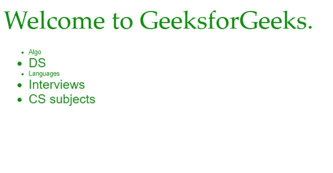

# CSS 预处理器| LESS

> 原文:[https://www.geeksforgeeks.org/css-preprocessor-less/](https://www.geeksforgeeks.org/css-preprocessor-less/)

**LESS** 代表 **Leaner 样式表**。它是 CSS 向后兼容的语言扩展。它允许我们使用变量、嵌套、混合等特性，所有这些都在一个 CSS 兼容的语法中。LESS 受到了 SASS 的影响，并影响了 SASS 较新的“SCSS”语法。Bootstrap 3 中使用了 LESS，但在 Bootstrap 4 中被 SASS 取代。

**先决条件:**

*   超文本标记语言
*   CSS

    **系统要求**

    *   **操作系统:**跨平台
    *   **浏览器支持:** IE (Internet Explorer 8+)，火狐，谷歌 Chrome，Safari。

    **文件类型:**所有 LESS 文件必须有*。少了*文件扩展名。

    **工作:**网络浏览器不理解 LESS 代码本身。这就是为什么你需要一个 LESS 预处理器来把 LESS 代码变成简单的标准 CSS 代码。

    **工作步骤:**

    *   在文件中编写 LESS 代码。
    *   使用命令*将 LESS 代码编译成 CSS 代码。*
    *   在 html 文件中包含编译后的 CSS 文件。

    **特征:**

    *   **变量:**变量可以用来存储可以重用的 CSS 值。它们用 *@* 初始化。

        ```html
        @lt-gray: #ddd;
        @background-dark: #512DA8;
        @carousel-item-height: 300px;
        ```

    *   **混合:T2 混合是一种将一组属性从一个规则集包含到另一个规则集的方式。

        ```html
        zero-margin {
            margin:0px auto;
            background:@white;
        }

        .row-header {
            .zero-margin;
            padding:0px auto;
        }

        .row-content {
            .zero-margin;
            border-bottom: 1px ridge;
            min-height:400px;
            padding: 50px 0px 50px 0px;
        }
        ```** 
    *   **筑巢:** LESS 给你使用筑巢的能力。

        ```html
        .carousel {
            background:@background-dark;

            .carousel-item {
                height: @carousel-item-height;
                img {
                    position: absolute;
                    top: 0;
                    left: 0;
                    min-height: 300px;
                }
            }
        }
        ```

    *   **数学运算:**算术运算+、-、*、/可以对任意数字、颜色或变量进行运算。

        ```html
        .carousel-item {
            height: @carousel-item-height;
        }

        .carousel-item .item-large {
            height: @carousel-item-height *2;
        }
        ```

    *   **功能:** LESS 提供数学、列表、字符串、颜色运算、颜色混合等多种功能。

        ```html
        @width: 0.8;

        .class {
            width: percentage(@width); // Returns `80%`
            color: saturate(@base, 5%);
            background-color: spin(lighten(@base, 25%), 8);
        }
        ```

    **示例:**文件名*gfg.html*

    ```html
    <!DOCTYPE html> 
    <html> 
        <head> 
            <meta charset="utf-8"/> 

            <title>LESS</title> 

            <meta name="viewport" content= 
                "width=device-width, initial-scale=1"> 

            <link rel="stylesheet" href="./css/style.css"> 
        </head> 

        <body> 
            <div class="head">Welcome to GeeksforGeeks. 
                <ul class="list"> 
                    <li class="a">Algo</li> 
                    <li>DS</li> 
                    <li class="a">Languages</li> 
                    <li>Interviews</li> 
                    <li>CS subjects</li> 
                </ul> 
            </div>     
        </body> 
    </html>                                      
    ```

    文件名*无样式*

    ```html
    @color-primary: #009900;
    @font-pri: Sans-Serif;
    @font-sec: Helvetica;

    body{
        color: @color-primary;
        font-size: 40px;
    }

    .list{
        font-family: @font-pri;
        font-size: 20px;
        .a{
            font-family: @font-sec;
            font-size: 10px;
        }
    }
    ```

    文件名 *style.css* 我们在传送 *style.less* 后得到

    ```html
    body {
      color: #009900;
      font-size: 40px;
    }
    .list {
      font-family: Sans-Serif;
      font-size: 20px;
    }
    .list .a {
      font-family: Helvetica;
      font-size: 10px;
    }
    ```

    **输出:**
    

    **优势:**

    *   LESS 兼容跨浏览器。
    *   LESS 提供了一个操作符列表，方便用户进行编码。
    *   由于变量的使用，维护很容易。

    **缺点:**

    *   与 SASS 相比，LESS 提供的框架更少。
    *   对于刚接触 CSS 的人来说，这可能很棘手。