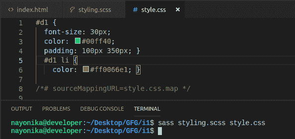
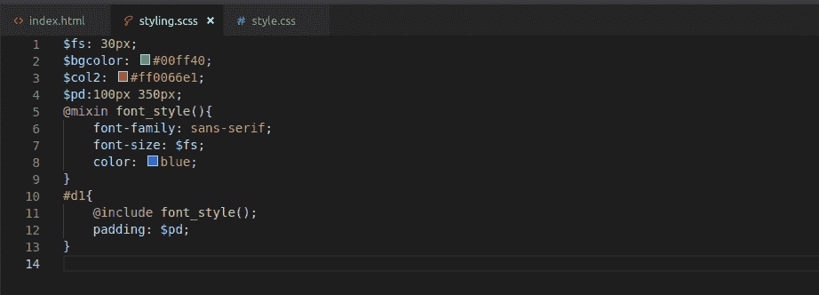

# CSS 预处理器 SASS

> 原文:[https://www.geeksforgeeks.org/css-preprocessor-sass/](https://www.geeksforgeeks.org/css-preprocessor-sass/)

**SASS** 是语法上令人敬畏的样式表的缩写。它是一个带有语法改进的 CSS 预处理程序。高级语法中的样式表由程序处理，编译成常规的 CSS 样式表，可以在网站中使用。这是一个 CSS 扩展，允许使用变量、嵌套、导入、混合、继承等特性，所有这些都在一个 CSS 兼容的语法 ie 中。，它兼容所有的 CSS 版本。

**注:**SASS 的详细安装过程请参考[https://sass-lang.com/install](https://sass-lang.com/install)链接。

有两种类型的语法可用于 SASS:

*   SCSS:使用这个语法的文件使用*。scss* 分机。
*   缩进语法(简称“sass”):旧语法，使用该语法的文件使用*。萨斯*分机。

**注:**本例使用*。scss* 分机。

**工作步骤:**

*   写 SCSS 代码。
*   使用命令*将 SCSS 代码编译成 CSS 代码。第一个文件名(input.scss)是要编译的 scss 文件，第二个文件名(output.css)是要包含/附加到 Html 文档中的已处理的 css 文件。*
*   在 Html 文件中包含编译后的 CSS 文件。

现在看看如何有效利用 SCSS 的重要特性，如变量、嵌套、混合和操作符。

*   主 HTML 文件名为*index.html*
*   SCSS 文件是*style . SCS*，CSS 文件是 *style.css*
*   编译 SCSS 文件的命令:*sass style . scss style . CSS*

**示例:**文件名*index.html*

## 超文本标记语言

```
<!DOCTYPE html>
<html>

<head>
    <meta charset="utf-8" />
    <title>SASS</title>
    <meta name="viewport" content="width=device-width, initial-scale=1">
    <link rel="stylesheet" href="style.css">
</head>

<body>
    <div id="d1">Welcome to GeeksforGeeks.
        <ul>
            <li>Algo</li>
            <li>DS</li>
            <li>Languages</li>
            <li>Interviews</li>
            <li>CS subjects</li>
        </ul>
    </div>
</body>

</html>
```

**变量:**变量可以用来存储可以重用的 CSS 值。要在 SASS 中声明一个变量，使用了字符。例如，$v_name。

```
$fs: 30px;
$bgcolor: #00ff40;
$pd: 100px 350px;
#dl {
 font-size: $fs;
 color: $bgcolor;
 padding: $pd;
}
```

该图显示了相同的代码:


编译完 CSS 代码后，通过 *style.css.* 保存到文件中

```
#dl {
 font-size: 30px;
 color: #00ff40;
 padding: 100px 350px;
}
```


[**【嵌套】**](https://www.geeksforgeeks.org/sass-nesting/) **:** SASS 允许 CSS 规则相互嵌套，遵循 HTML 相同的视觉层次结构。例如，CSS 属性可以用于嵌套在 div 标签中的< li >标签。

```
$fs: 30px;
$bgcolor: #00ff40;
#col2: #ff0066e1;
$pd: 100px 350px;
#dl {
 font-size: $fs;
 color: $bgcolor;
 padding: $pd;
 li {
   color: $col2;
 }
}
```


编译完 CSS 代码后，通过 *style.css.* 保存文件

```
#dl {
 font-size: 30px;
 color: #00ff40;
 padding: 100px 350px;
}
#dl li {
 color: #ff0066e1;
}
```



**输出:**


[**Mixins**](https://www.geeksforgeeks.org/sass-mixin-and-include/)**:**Mixins 有助于使一组 CSS 属性可重用，即保存一个代码并反复使用。可以使用 *@include* 指令将其包含在其他 CSS 规则中。

**示例:**这个示例描述了@mixin & @include 的用法。

```
$fs: 30px;
$bgcolor: #00ff40;
#col2: #ff0066e1;
$pd: 100px 350px;
@mixin font_style() {
 font-family: sans-serif;
 font-size: $fs;
 color: blue;
}
#dl {
 @include font_style();
 padding: $pd;
}
```



编译完 CSS 代码后变成:

```
#dl {
 font-family: sans-serif;
 font-size: 30px;
 color: blue;
 padding: 100px 350px;
}
```


**网页的输出:**


**示例:** Mixins 也可以将变量作为参数。在 CSS 规则中包含这些值的同时传递这些值。

```
$fs: 30px;
#col2: #ff0066e1;
$pd: 100px 350px;
@mixin font_style() {
 font-family: sans-serif;
 font-size: $fs;
 color: blue;
}
@mixin list_style($size, $color) {
 font-size: $size;
 color: $color;
}
#dl {
 @include font_style();
 padding: $pd;
 li {
   @include list_style(20px, red);
 }
}
```


编译后的 CSS 代码:

```
#dl {
 font-family: sans-serif;
 font-size: 30px;
 color: blue;
 padding: 100px 350px;
}
#dl li {
 font-size: 20px;
 color: red;
}
```


**最终输出:**

