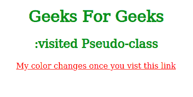

# CSS |伪类

> 原文:[https://www.geeksforgeeks.org/css-pseudo-classes/](https://www.geeksforgeeks.org/css-pseudo-classes/)

CSS 中的伪类用于定义元素的特殊状态。它可以与 CSS 选择器结合，根据现有元素的状态为其添加效果。例如，当用户悬停在元素上或访问链接时，更改元素的样式。所有这些都可以使用 CSS 中的伪类来完成。

**注意**伪类名不区分大小写。

**语法:**

```css
selector: pseudo-class{
     property: value;
}
```

CSS 中有很多伪类，但最常用的如下:

*   **:悬停伪类:**这个伪类是用来在我们的鼠标指针在一个元素上面的时候，给这个元素添加特殊效果的。下面的例子演示了当你的鼠标进入盒子区域时，它的背景颜色从黄色变成了橙色。
    T3】例:

## 超文本标记语言

```css
<!DOCTYPE html>
<html>
<head>
    <title>CSS transition-property property</title>
    <style>
    .box{
        background-color: yellow;
        width: 300px;
        height: 200px;
        margin: auto;
        font-size: 40px;
        text-align: center;
    }

    .box:hover{
        background-color: orange;
    }

    h1, h2{
        color: green;
        text-align: center;
    }
    </style>
</head>

<body>
    <h1>Geeks For Geeks</h1>
    <h2>:hover Pseudo-class</h2>
    <div class="box">
        My color changes if you hover over me!
    </div>
</body>
</html>                   
```

*   **输出:**


*   **:活动伪类:**该伪类用于选择用户点击时激活的元素。下面的示例演示了当您单击该框时，它的背景颜色会改变一会儿。
    T3】例:

## 超文本标记语言

```css
<!DOCTYPE html>
<html>
<head>
    <title>CSS transition-property property</title>
    <style>
    .box{
        background-color: yellow;
        width: 300px;
        height: 200px;
        margin: auto;
        font-size: 40px;
        text-align: center;
    }

    .box:active{
        background-color: orange;
    }

    h1, h2{
        color: green;
        text-align: center;
    }
    </style>
</head>

<body>
    <h1>Geeks For Geeks</h1>
    <h2>:active Pseudo-class</h2>
    <div class="box">
        My color changes for a moment if you click me!
    </div>
</body>
</html>                   
```

*   **输出:**


*   **:焦点伪类:**该伪类用于选择用户当前关注的元素。它对表单中使用的用户输入元素起作用，并在用户单击它时立即被触发。在下面的示例中，当前聚焦的输入字段的背景颜色发生了变化。
    T3】例:

## 超文本标记语言

```css
<!DOCTYPE html>
<html>
<head>
    <title>CSS transition-property property</title>
    <style>
    form{
        width: 300px;
        height: 200px;
        margin: 0 auto;
        text-align: center;
        line-height: 2rem;
    }

    label{
        width: 30%;
    }

    input{
        background-color: default;
        float: right;
    }

    input:focus{
        background-color: grey;
    }

    h1, h2{
        color: green;
        text-align: center;
    }
    </style>
</head>

<body>
    <h1>Geeks For Geeks</h1>
    <h2>:focus Pseudo-class</h2>
    <form>
        <label for="username">Username:</label>
        <input type="text" name="username"
                placeholder="Enter your username" />
      <br>

        <label for="emailid">Email-Id:</label>
        <input type="email" name="emailid"
                placeholder="Enter your email-id" />

        <label for="Password">Password:</label>
        <input type="password" name="Password"
                placeholder="Enter your password" />
    </form>
</body>
</html>                   
```

*   **输出:**


*   **:已访问伪类:**该伪类用于选择用户已经访问过的链接。在下面的示例中，链接一旦被访问，其颜色就会改变。
    T3】例:

## 超文本标记语言

```css
<!DOCTYPE html>
<html>
<head>
    <title>CSS transition-property property</title>
    <style>
    body{
        text-align: center;
    }

    h1, h2{
        color: green;
    }

    a:visited{
        color: red;
    }
    </style>
</head>

<body>
    <h1>Geeks For Geeks</h1>
    <h2>:visited Pseudo-class</h2>

<p>
        <a href="https://www.geeksforgeeks.org/" target="_blank">
            My color changes once you vist this link
        </a>
    </p>

</body>
</html>                   
```

*   **输出:**

