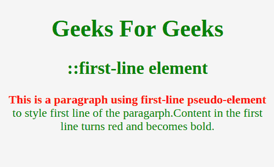

# CSS |伪元素

> 原文:[https://www.geeksforgeeks.org/css-pseudo-elements/](https://www.geeksforgeeks.org/css-pseudo-elements/)

CSS 伪元素是添加到选择器中的关键字，它允许您为所选元素的特定部分设置样式。例如，为元素的第一个字母或第一行设置样式，

在元素内容之前或之后插入内容。所有这些都可以使用 CSS 中的伪元素来完成。

**注意**与伪元素相反，伪类可以用于根据元素的状态为其设置样式。

**语法:**

```html
selector::pseudo-element {
 property: value;
}
```

CSS 中有很多伪元素，但最常用的如下:

*   **::第一行伪元素**将样式应用于块级元素的第一行。请注意，第一行的长度取决于许多因素，包括元素的宽度、文档的宽度和文本的字体大小。请注意，只有少数属性应用于第一行伪元素，如字体属性、颜色属性、背景属性、字间距、字母间距、文本装饰、垂直对齐、文本转换、行高、清晰等。

**示例:**

## 超文本标记语言

```html
<!DOCTYPE html>
<html lang="en">
<head>
    <title>first-line Demo</title>
    <style>
        body{
          background-color:whitesmoke;
          color:green;
          font-size: large;
          text-align: center;
      }

        p::first-line{
          color:Red;
          font-weight: bold;
      }
    </style>
</head>
<body>
    <h1>Geeks For Geeks</h1>
    <h2>::first-line element</h2>

<p>This is a paragraph using first-line pseudo-element
      to style first line of the paragraph.Content in the
      first line turns red and becomes bold.</p>

</body>
</html>
```

**输出:**



*   **::第一个字母伪元素**将样式应用于块级元素第一行的第一个字母，但仅当前面没有其他内容(如图像或内嵌表格)时。请注意，只有少数属性应用于第一行伪元素，如字体属性、颜色属性、背景属性、字间距、字母间距、文本装饰、垂直对齐、文本转换、行高、清晰等。

**示例:**

## 超文本标记语言

```html
<!DOCTYPE html>
<html lang="en">
<head>
    <title>first-letter Demo</title>
    <style>
        body{
          background-color:whitesmoke;
          color:green;
          font-size: large;
          text-align: center;
      }
        p::first-letter{
          color:Red;
          font-size: 30px;
          font-weight: bold;
      }
    </style>
</head>
<body>
    <h1>Geeks For Geeks</h1>
    <h2>::first-letter element</h2>

<p>This is a paragraph using first-letter pseudo-element
      to style first letter of the paragraph.first-letter element
      turned the first letter of this paragraph to red
      and made it bold.</p>

</body>
</html>
```

**输出:**


*   ::**在伪元素**之前创建一个伪元素，它是所选元素的第一个子元素。它通常用于向具有 content 属性的元素添加修饰内容。默认情况下，它是内联的。

**示例:**

## 超文本标记语言

```html
<!DOCTYPE html>
<html lang="en">
<head>
    <title>before Demo</title>
    <style>
        body{
          background-color:whitesmoke;
          color:green;
          font-size: large;
          text-align: center;
      }
        p::before{
          content: '"';
          color: red;
          font-size: 30px;
      }
    </style>
</head>
<body>
    <h1>Geeks For Geeks</h1>
    <h2>::before element</h2>

<p>This is a paragraph to which we added red color quotation marks
      using ::before element.</p>

</body>
</html>
```

**输出:**


*   **::在伪元素**之后创建伪元素，该伪元素是所选元素的最后一个子元素。它通常用于向具有 content 属性的元素添加修饰内容。默认情况下，它是内联的。

**示例:**

## 超文本标记语言

```html
<!DOCTYPE html>
<html lang="en">
<head>
    <title>after Demo</title>
    <style>
        body{
          background-color:whitesmoke;
          color:green;
          font-size: large;
          text-align: center;
          }
        p::after{
          content: '"';
          color: red;
          font-size: 30px;
        }
    </style>
</head>
<body>
    <h1>Geeks For Geeks</h1>
    <h2>::after element</h2>

<p>This is a paragraph to which we added red color quotation marks
      using ::after element.</p>

</body>
</html>
```

**输出:**


*   **::标记伪元素**选择列表项的标记框，该标记框通常包含项目符号或数字。它适用于设置为显示的任何元素或伪元素:列表项，例如< li >和< summary >元素。

**示例:**

## 超文本标记语言

```html
<!DOCTYPE html>
<html lang="en">
<head>
    <title>marker Demo</title>
    <style>
        body{
          background-color: whitesmoke;
          color: green;
          text-align: center;
        }
        ul{
          width: 40px;
        }
        ul li::marker{
          color: red;
          font-size: 30px;
        }
    </style>
</head>
<body>
    <h1>Geeks For Geeks</h1>
    <h2>::marker element</h2>
    <ul>
        <li>HTML</li>
        <li>CSS</li>
        <li>JavaScript</li>
    </ul>
</body>
</html>
```

**输出:**


*   **::选择伪元素**将样式应用于文档中已被用户高亮显示的部分，例如在文本上单击并拖动鼠标。

**示例:**

## 超文本标记语言

```html
<!DOCTYPE html>
<html lang="en">
<head>
    <title>selection Demo</title>
    <style>
        body{
            background-color: whitesmoke;
            color: green;
            text-align: center;
        }
        p::selection{
            color: red;
            background-color: green;
            font-size: 30px;
        }
        ::selection{
            color: green;
            background-color: red;
            font-size: 30px;
        }
    </style>
</head>
<body>
    <h1>Geeks For Geeks</h1>
    <h2>::selection element</h2>

<p>Content in this paragraph turns red with
      green background on selection.</p>

    <span>As this is not a paragraph, you can notice red
      background and green text on selection.</span>
</body>
</html>
```

**输出:**

