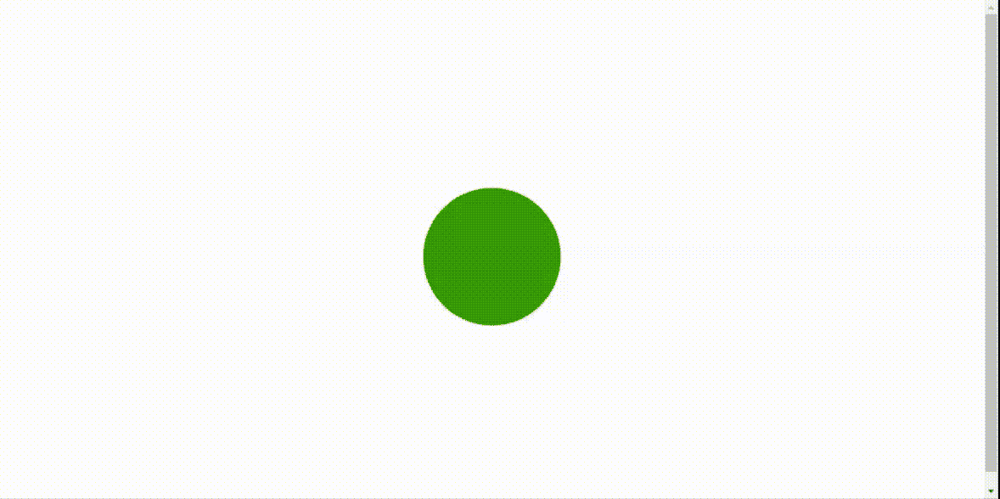
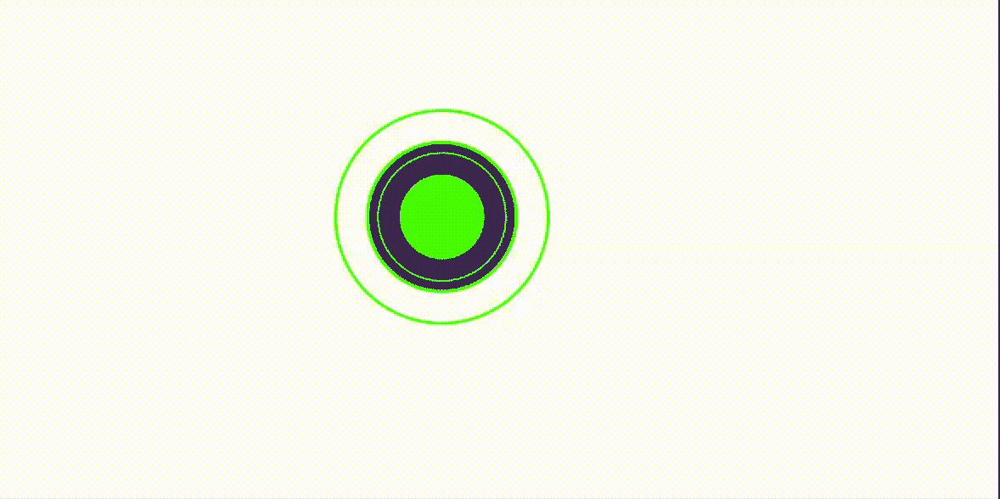

# CSS |脉搏动画

> 原文:[https://www.geeksforgeeks.org/css-pulse-animation/](https://www.geeksforgeeks.org/css-pulse-animation/)

CSS 脉冲动画效果为元素提供脉冲效果，改变其形状和不透明度。根据时间和需要，使用不同的*@关键帧*来实现该动画。简单而强大的效果使网站更加充满活力、丰富多彩和吸引人。这个动画是完全不用 JavaScript 实现的。

**例 1:** 下面的例子展示了一个向外的脉冲块，当它达到最大尺寸时，它会自我拉伸，然后收缩，从圆形开始，到每次改变形状时都会出现不同颜色的方形结束。

```css
<!DOCTYPE html>
<html>

<head>
    <title>
        CSS | Pulse animation
    </title>

    <style>
        .element {
            height: 250px;
            width: 250px;
            margin: 0 auto;
            background-color: lime;
            animation-name: stretch;
            animation-duration: 2.0s;
            animation-timing-function: ease-out;
            animation-direction: alternate;
            animation-iteration-count: infinite;
            animation-play-state: running;
        }

        @keyframes stretch {
            0% {
                transform: scale(.5);
                background-color: green;
                border-radius: 100%;
            }

            50% {
                background-color: orange;
            }

            100% {
                transform: scale(2.0);
                background-color: red;
            }
        }

        body,
        html {
            height: 100%;
        }

        body {
            display: flex;
            align-items: center;
            justify-content: center;
        }
    </style>
</head>

<body>
    <div class="element"></div>
</body>

</html>
```

**输出:**


**示例 2:** 以下示例显示了在圆上产生向内或反向脉冲的动画效果，该效果完成后会产生向内的圆形脉冲。它会膨胀回到原来的状态，这种效果会持续下去。

```css
<!DOCTYPE html>
<html>

<head>
    <title>Reverse Pulse </title>
    <link rel="stylesheet" 
        type="text/css" href="style.css">

    <style>
        .pulse {
            position: absolute;
            top: 35%;
            left: 40%;
            transform: translate(-505, -50%);
            width: 100px;
            height: 100px;
            background: #33ff00;
            border: 2px solid #33ff00;
            border-radius: 50%;
            box-sizing: border-box;
            box-shadow: 0 0 0 36px #45237a,
                    0 0 0 40px #56ff00;
        }

        .pulse:before,
        .pulse:after {
            content: '';
            position: absolute;
            left: -30px;
            top: -30px;
            right: -30px;
            bottom: -30px;
            border: 2px solid #33ff00;
            border-radius: 50%;
            animation: animate 2s linear infinite
        }

        .pulse:after {
            animation-delay: 1s;
        }

        @keyframes animate {
            0% {
                transform: scale(2.0);
            }

            100% {
                transform: scale(0.7);
            }
        }
        }
    </style>
</head>

<body>
    <div class="pulse"></div>
</body>

</html>
```

**输出:**
