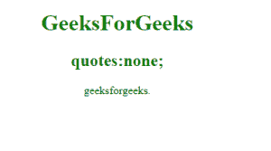
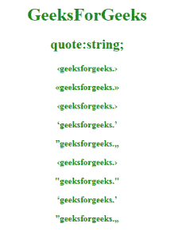

# CSS |引号属性

> 原文:[https://www.geeksforgeeks.org/css-quotes-property/](https://www.geeksforgeeks.org/css-quotes-property/)

此属性用于指定句子中使用的引号。

**语法:**

```css
quotes: none|auto|string;
```

**默认值:自动**

**房产价值:**

**无:**为默认值。它不会产生任何引号。
语法:

```css
quotes:none;
```

**例:**

## 超文本标记语言

```css
<!DOCTYPE html>
<html>
    <head>
        <title>
            CSS | quotes Property
        </title>
        <style>
            #geeks {
                quotes:none;
            }
        </style>
    </head>
    <body>
        <center>
        <h1 style="color:green;">GeeksForGeeks</h1>
        <h2 style="color:green;">quotes:none;</h2>

<p><q id="geeks">geeksforgeeks.</q></p>

        </center>
    </body>
</html>                   
```

**输出:**



**字符串:**这个属性用来指定句子中应该使用什么类型的引号。前两个值表示引号的第一级。后两个值表示引号的第二级。
**语法:**

```css
quotes:string;
```

**例:**

## 超文本标记语言

```css
<!DOCTYPE html>
<html>
    <head>
        <title>
            CSS | quotes Property
        </title>
        <style>
            #geeks {
                quotes:'‹' '›';
            }
            #gfg {
                quotes:'«' '»';
            }
            #sudo {
                quotes:'‹' '›' '«' '»' ;}
            #g {
                quotes:'‘' '’' ;}
            #f {
                quotes:'”' '„';
            }
            #for {
                quotes:'\2039' '\203A';
            }
            #data {
                quotes:'\''00AB'
                       '\00BB';
            }
            #q {
                quotes:'\2039' '\203A'
                       '\00AB'
                       '\00BB';
            }
            #google {
                quotes:'\2018' '\2019';
            }
            #mark{
                quotes:'\201D' '\201E';}
            h4 {
                color:green;
            }

        </style>
    </head>
    <body>
        <center>
            <h1 style="color:green;">GeeksForGeeks</h1>
            <h2 style="color:green;">quotes:string;</h2>
            <h4>

<p><q id="geeks">geeksforgeeks.</q></p>

<p><q id="gfg">geeksforgeeks.</q></p>

<p><q id="sudo">geeksforgeeks.</q></p>

<p><q id="q">geeksforgeeks.</q></p>

<p><q id="f">geeksforgeeks.</q></p>

<p><q id="for">geeksforgeeks.</q></p>

<p><q id="data">geeksforgeeks.</q></p>

<p><q id="google">geeksforgeeks.</q></p>

<p><q id="mark">geeksforgeeks.</q></p>

            </h4>
        </center>
    </body>
</html>                   
```

**输出:**



**支持的浏览器:**T2 报价属性支持的浏览器如下:

*   谷歌 Chrome 11.0
*   Internet Explorer 8.0
*   Firefox 1.5
*   Opera 4.0
*   Safari 5.1