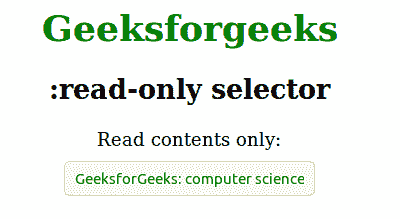
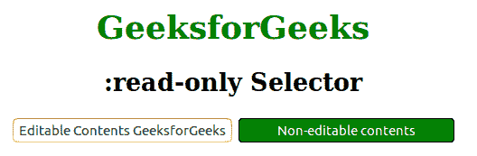

# CSS |:只读选择器

> 原文:[https://www.geeksforgeeks.org/css-read-only-selector/](https://www.geeksforgeeks.org/css-read-only-selector/)

:只读选择器用于选择仅*可读的元素*。只读用于禁用字段。主要是只读的伪类表示用户无法编辑的元素。

**语法:**

```html
:read-only {
    // CSS property
}

```

**例 1:**

```html
<!DOCTYPE html>
<html>
    <head>
        <style>
            input:-moz-read-only {
                text-align: center;
                margin:10px;
                padding: 5px;
                color:Green;
            }
            input:read-only {
                text-align: center;
                margin:10px;
                padding: 5px;
                color:Green;
            }
            h1 {
                color:green;
            }
            body {
                text-align:center;
            }
        </style>
    </head>
    <body>
        <h1>Geeksforgeeks</h1>
        <h2>:read-only selector</h2>
        <p>Read contents only:<br><input readonly value = 
        "GeeksforGeeks: computer science portal"></p>
    </body>
</html>                    
```

**输出:**


**例 2:**

```html
<!DOCTYPE html> 
<html> 
    <head> 
        <title>:read-only selector</title> 
        <style> 
            h1 { 
                color:green; 
            } 
            input:read-only {
                background-color:Green;
                color:white;
                text-align:center;
            }
            input:-moz-read-only {
                background-color:Green;
                border:1px solid black;
                border-radius:4px;
                padding:4px;
                color:white;
                text-align:center;
            }
            body {
                text-align:center;
            }
        </style> 
    </head> 
    <body> 
        <h1>GeeksforGeeks</h1> 
        <h2>:read-only Selector</h2> 
        <input type="text" value="Editable Contents">
        <input type="text" value="Non-editable contents" readonly>
    </body> 
</html>                    
```

**输出:**


**支持的浏览器:**只读选择器支持的浏览器如下:

*   谷歌 Chrome 36.0
*   Internet Explorer 13.0
*   火狐 3.0 -moz-
*   Safari 9.0
*   Opera 23.0