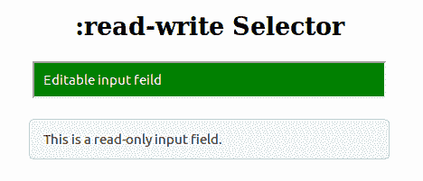
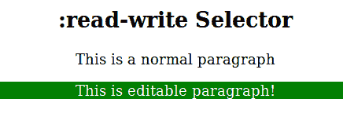

# CSS |:读写选择器

> 原文:[https://www.geeksforgeeks.org/css-read-write-selector/](https://www.geeksforgeeks.org/css-read-write-selector/)

:读写选择器用于选择用户可编辑的元素(如输入文本)。没有*只读*和*禁用*属性的元素被定义为可读和可写。

**语法:**

```html
:read-write {
    // CSS Property
}
```

**例 1:**

```html
<!DOCTYPE html>
<html>
    <head>
        <title>:read-write Selector</title>
        <style>
            input {
                min-width: 25em;
                padding: 10px;
            }

            /* CSS property for Firefox only */
            input:-moz-read-write { 
                background: green;
                color: white;
            }

            input:read-write { 
                background: green;
                color: white;
            }
        </style>
    </head>
    <body style = "text-align:center">

        <h2>
            :read-write Selector
        </h2>
        <input type = "text" value = 
        "Editable input field"><br><br>

        <input type = "text" value = 
        "This is a read-only input field." readonly>
    </body>
</html>                    
```

**输出:**


**例 2:**

```html
<!DOCTYPE html>
<html>
    <head>
        <title>:read-write Selector</title>
        <style>
            p:-moz-read-write { 
                background: green;
            }
            p:read-write { 
                background: green; 
            } 
            p[contenteditable = "true"] { 
                color: white;
            }
        </style>
    </head>

    <body style = "text-align:center">
        <h2>
            :read-write Selector
         </h2>

        <p>
            This is a normal paragraph
        </p>
        <p contenteditable = "true">
            This is editable paragraph!
        </p>
    </body>
</html>                    
```

**输出:**


**支持的浏览器:***:读写*选择器支持的浏览器如下:

*   苹果 Safari 9.0
*   谷歌 Chrome 36.0
*   火狐 3.0 -moz-
*   Opera 23.0
*   Internet Explorer 13.0