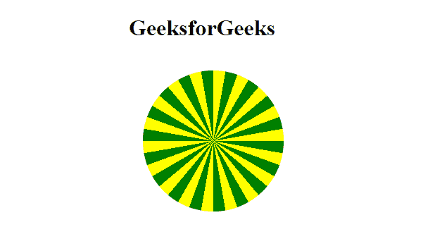

# CSS 重复-圆锥-渐变()函数

> 原文:[https://www . geesforgeks . org/CSS-repeating-conic-gradient-function/](https://www.geeksforgeeks.org/css-repeating-conic-gradient-function/)

**重复圆锥梯度()**函数是 CSS 中的一个内置函数，用于在背景图像中重复圆锥梯度。

**语法:**

> 背景图像:重复圆锥函数(从角度、色阶 1 度 2、色阶 1 度 2、…)；

**参数:**

*   **角度:**该参数以角度为值，定义顺时针方向的渐变旋转。
*   **颜色度数 1 度 2:** 此参数保存颜色值，后面分别是开始位置(以度为单位)和结束位置(以度为单位)。

**示例:**以下示例说明了 CSS 中的**重复-圆锥-渐变()**函数。

## 超文本标记语言

```css
<!DOCTYPE html>
<html>

<head>
    <style>
        .container {
            background-color: green;
            height: 200px;
            width: 200px;
            float: left;
            margin: 20px;
            border-radius: 50%;
        }

        .a {
            background-image:
                repeating-conic-gradient(
                    from 10deg, 
                    green 0deg 10deg, 
                    yellow 10deg 20deg
                );
        }
    </style>
</head>

<body>
    <h1>GeeksforGeeks</h1>
    <div class="container a"></div>
</body>

</html>
```

**输出:**



重复锥形梯度

**支持的浏览器:**

*   谷歌 Chrome 69.0 及以上版本
*   互联网浏览器:不支持
*   Mozilla 83.0 及以上版本
*   Opera 56.0 及以上版本
*   Safari 12.1 及以上版本