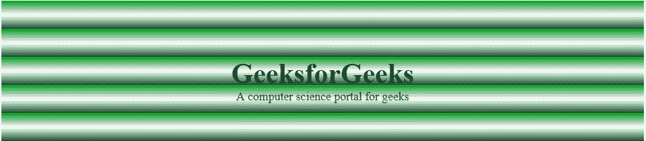
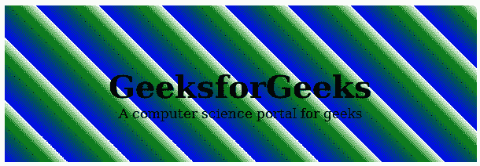

# CSS |重复-线性-渐变()函数

> 原文:[https://www . geesforgeks . org/CSS-repeating-linear-gradient-function/](https://www.geeksforgeeks.org/css-repeating-linear-gradient-function/)

重复线性渐变()函数是 CSS 中的一个内置函数，用于重复线性渐变。

**语法:**

```html
background-image: repeating-linear-gradient( angle | to side-or-corner, color-stop1,
color-stop2, ...); 
```

**参数:**该功能接受下列许多参数:

*   **角度:**此参数用于保持渐变的方向角度。它的值介于 0 到 360 度之间。默认情况下，其值为 180 度。
*   **侧角或角:**此参数用于定义渐变线起点的位置。它由两个关键词组成:第一个表示水平边，左边或右边，第二个表示垂直边，顶部或底部。顺序无关，每个关键字都是可选的。
*   **颜色停止 1、颜色停止 2、…:** 此参数用于保存颜色值及其可选停止位置。

以下示例说明了 CSS 中的重复线性渐变()函数:

**例 1:**

```html
<!DOCTYPE html> 
<html> 
    <head> 
        <title>repeating-linear-gradient() Function</title> 
        <style> 
            #main { 
                height: 200px; 
                background-color: white; 
                background-image: repeating-linear-gradient(#090, 
                                        #fff 10%, #2a4f32 20%); 
            } 
            .gfg { 
                text-align:center; 
                font-size:40px; 
                font-weight:bold; 
                padding-top:80px; 
            } 
            .geeks { 
                font-size:17px; 
                text-align:center; 
            } 
        </style> 
    </head> 
    <body> 
        <div id="main"> 
            <div class = "gfg">GeeksforGeeks</div> 
            <div class = "geeks">A computer science portal for geeks</div> 
        </div> 
    </body> 
</html>                    
```

**输出:**


**例 2:**

```html
<!DOCTYPE html> 
<html> 
    <head> 
        <title>repeating-linear-gradient() Function</title> 
        <style> 
            #main { 
                height: 200px; 
                background-color: white; 
                background-image: repeating-linear-gradient(45deg, 
                blue, green 7%, white 10%); 
            } 
            .gfg { 
                text-align:center; 
                font-size:40px; 
                font-weight:bold; 
                padding-top:80px; 
            } 
            .geeks { 
                font-size:17px; 
                text-align:center; 
            } 
        </style> 
    </head> 
    <body> 
        <div id="main"> 
            <div class = "gfg">GeeksforGeeks</div> 
            <div class = "geeks">A computer science portal for geeks</div> 
        </div> 
    </body> 
</html>                    
```

**输出:**
