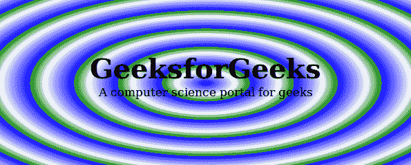
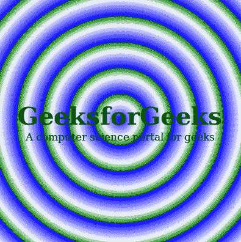

# CSS |重复-径向-渐变()函数

> 原文:[https://www . geesforgeks . org/CSS-repeating-radial-gradient-function/](https://www.geeksforgeeks.org/css-repeating-radial-gradient-function/)

重复径向梯度()函数是 CSS 中的一个内置函数，用于重复径向梯度。
**语法:**

```css
background-image: repeating-radial-gradient(shape size at position, 
start-color, ..., last-color); 
```

**参数:**该功能接受很多参数，如下所示:

*   **形状:**此参数用于定义渐变的形状。它有两个可能的值圆或椭圆。默认形状值为椭圆形。
*   **大小:**此参数用于定义渐变的大小。可能的值有:最远角(默认)、最近边、最近角、最远边。
*   **位置:**此参数用于定义坡度的位置。默认值为中心。
*   **起始颜色、…、最后颜色:**此参数用于保存颜色值，后跟可选的停止位置。

以下示例说明 CSS 中的重复-径向-渐变()函数:
**示例:**

## 超文本标记语言

```css
<!DOCTYPE html>
<html>
    <head>
        <title>CSS Gradients</title>
        <style>
            #main {
                height: 250px;
                width: 600px;
                background-color: white;
                background-image: repeating-radial-gradient(blue,
                white 10%, green 15%)
            }
            .gfg {
                text-align:center;
                font-size:40px;
                font-weight:bold;
                padding-top:80px;
            }
            .geeks {
                font-size:17px;
                text-align:center;
            }
        </style>
    </head>
    <body>
        <div id="main">
            <div class = "gfg">GeeksforGeeks</div>
            <div class = "geeks">A computer science portal for geeks</div>
        </div>
    </body>
</html>                    
```

**输出:**



**例 2:**

## 超文本标记语言

```css
<!DOCTYPE html>
<html>
    <head>
        <title>CSS Gradients</title>
        <style>
            #main {
                height: 400px;
                width: 400px;
                background-color: white;
                background-image: repeating-radial-gradient(circle,
                blue, white 10%, green 15%)
            }
            .gfg {
                text-align:center;
                font-size:40px;
                font-weight:bold;
                padding-top:170px;
            }
            .geeks {
                font-size:17px;
                text-align:center;
            }
        </style>
    </head>
    <body>
        <div id="main">
            <div class = "gfg">GeeksforGeeks</div>
            <div class = "geeks">A computer science portal for geeks</div>
        </div>
    </body>
</html>                    
```

**输出:**



**支持的浏览器:**

*   谷歌 Chrome
*   微软公司出品的 web 浏览器
*   火狐浏览器
*   歌剧
*   旅行队