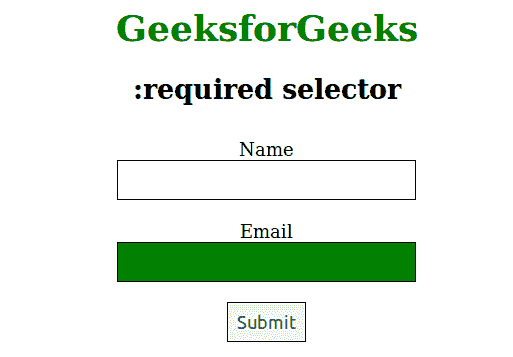

# CSS |:必选选择器

> 原文:[https://www.geeksforgeeks.org/css-required-selector/](https://www.geeksforgeeks.org/css-required-selector/)

所需选择器用于选择具有所需属性的所需元素并设置 CSS 属性。表单元素的必需属性根据需要定义。

**注意:**该选择器用于表单元素，如<输入>、<选择>和<文本区>。

**语法:**

```html
:required {
    // CSS Property
} 

```

**示例:**

```html
<!DOCTYPE html>
<html>
    <head>
        <title>:required Selector</title>
        <style>         
            h1 {
                color: green;
            }
            body {
                text-align:center;
            }
            input:required {
                background-color: green;
                color: white;
            }
            form div {
                padding: 10px;
            }
            label {
                display: block;
                font-size: 18px;
            }
            input {
                border: 1px solid black;
                padding: 9px;
                font-size: 18px;
            }
        </style>
    </head>
    <body>
        <h1>GeeksforGeeks</h1>
        <h2>:required selector</h2>
        <form>
            <div>
                <label for="name">Name</label>
                <input type="text" name="name" id="name"/>
            </div>
            <div>
                <label for="email">Email</label>
                <input type="email" name="email" id="email" required />
            </div>
            <div>
                <input type="submit" value="Submit" />
            </div>
        </form> 
    </body>
</html>                    
```

**输出:**


**支持的浏览器:**所需选择器支持的浏览器如下:

*   苹果 Safari 5.0
*   谷歌 Chrome 10.0
*   Firefox 4.0
*   opera10.0
*   Internet Explorer 10.0