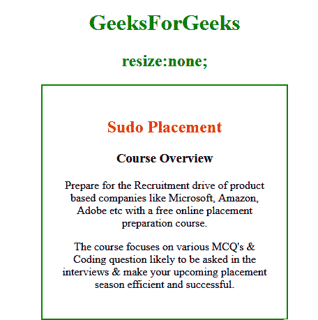
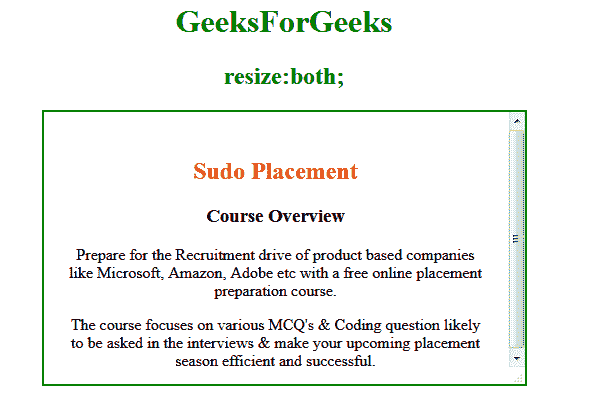
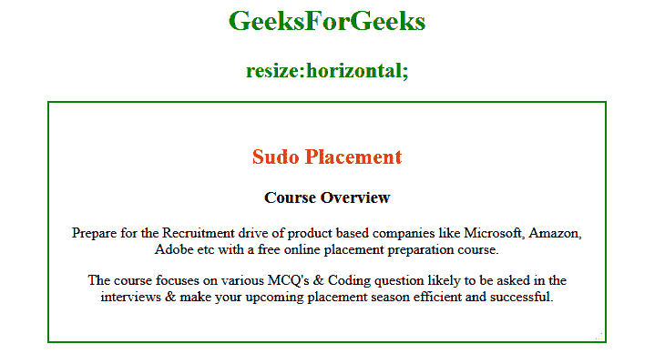
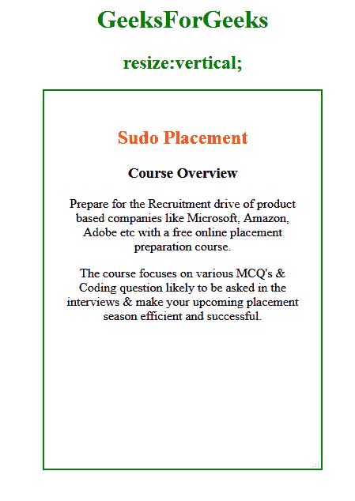

# CSS |调整属性大小

> 原文:[https://www.geeksforgeeks.org/css-resize-property/](https://www.geeksforgeeks.org/css-resize-property/)

CSS 中的 **resize** 属性用于根据用户需求调整元素大小。它不适用于内联元素或溢出可见的块元素。

**语法:**

```html
resize: none|both|horizontal|vertical|initial;
```

**属性值:**

*   没有人
*   两者
*   水平的
*   垂直的
*   initial

    **无:**用户无法调整元素大小。这是一个默认值。

    **示例:**

    ```html
    <!DOCTYPE html>
    <html>
        <head>
            <title>resize property</title>
            <style> 
                .gfg{
                    border: 2px solid green;
                    padding: 25px; 
                    width: 300px;
                    resize: none;
                    overflow: auto;
                }
                h1, h2 {
                    color: green;
                }
            </style>
        </head>
        <body>
            <center>
                <h1>GeeksForGeeks</h1>
                <h2>resize: none;</h2>
                <div class="gfg">
                    <h2 style="color:red;">Sudo Placement</h2>
                    <h3>Course Overview</h3>
                    <p>
                    Prepare for the Recruitment drive of product 
                    based companies like Microsoft, Amazon, Adobe
                    etc with a free online placement preparation 
                    course.
                    </p>
                    <p> 
                    The course focuses on various MCQ's & Coding
                    question likely to be asked in the interviews 
                    & make your upcoming placement season efficient
                    and successful.
                    </p>
                </div>
            </center>
        </body>
    </html>                    
    ```

    **输出:**
    

    **两者:**元素应该在两侧调整大小，即高度和宽度。

    **示例:**

    ```html
    <!DOCTYPE html>
    <html>
        <head>
            <title>resize property</title>
            <style> 
                .gfg{
                    border: 2px solid green;
                    padding: 25px; 
                    width: 300px;
                    resize: both;
                    overflow: auto;
                }
                h1, h2 {
                    color: green;
                }
            </style>
        </head>
        <body>
            <center>
                <h1>GeeksForGeeks</h1>
                <h2>resize:both;</h2>
                <div class="gfg">
                    <h2 style="color:red;">Sudo Placement</h2>
                    <h3>Course Overview</h3>
                     <p>
                    Prepare for the Recruitment drive of product 
                    based companies like Microsoft, Amazon, Adobe
                    etc with a free online placement preparation 
                    course.
                    </p>
                    <p> 
                    The course focuses on various MCQ's & Coding
                    question likely to be asked in the interviews 
                    & make your upcoming placement season efficient
                    and successful.
                    </p>
                </div>
            </center>
        </body>
    </html>                    
    ```

    **输出:**
    

    **水平:**用于用户只调整元素的宽度。

    **示例:**

    ```html
    <!DOCTYPE html>
    <html>
        <head>
            <title>tesize property</title>
            <style> 
                .gfg{
                    border: 2px solid green;
                    padding: 25px; 
                    width: 300px;
                    resize: horizontal;
                    overflow: auto;
                }
                h1, h2 {
                    color: green;
                }
            </style>
        </head>
        <body>
            <center>
                <h1>GeeksForGeeks</h1>
                <h2>resize:horizontal;</h2>
                <div class="gfg">
                    <h2 style="color:red;">Sudo Placement</h2>
                    <h3>Course Overview</h3>
                     <p>
                    Prepare for the Recruitment drive of product 
                    based companies like Microsoft, Amazon, Adobe
                    etc with a free online placement preparation 
                    course.
                    </p>
                    <p> 
                    The course focuses on various MCQ's & Coding
                    question likely to be asked in the interviews 
                    & make your upcoming placement season efficient
                    and successful.
                    </p>
                </div>
            </center>
        </body>
    </html>                    
    ```

    **输出:**
    

    **垂直:**仅用于根据用户要求调整元素高度。

    **示例:**

    ```html
    <!DOCTYPE html>
    <html>
        <head>
            <title>resize property</title>
            <style> 
                .gfg{
                    border: 2px solid green;
                    padding: 25px; 
                    width: 300px;
                    resize: vertical;
                    overflow: auto;
                }
                h1, h2 {
                    color: green;
                }
            </style>
        </head>
        <body>
            <center>
                <h1 style="color:green;">GeeksForGeeks</h1>
                <h2 style="color:green;">resize:vertical;</h2>
                <div class="gfg">
                    <h2 style="color:red;">Sudo Placement</h2>
                    <h3>Course Overview</h3>
                     <p>
                    Prepare for the Recruitment drive of product 
                    based companies like Microsoft, Amazon, Adobe
                    etc with a free online placement preparation 
                    course.
                    </p>
                    <p> 
                    The course focuses on various MCQ's & Coding
                    question likely to be asked in the interviews 
                    & make your upcoming placement season efficient
                    and successful.
                    </p>
                </div>
            </center>
        </body>
    </html>                    
    ```

    **输出:**
    

    **初始值:**将属性设置为默认值。这和没有财产是一样的。

    **例；**

    ```html
    <!DOCTYPE html>
    <html>
        <head>
            <title>resize property</title>
            <style> 
                .gfg{
                    border: 2px solid green;
                    padding: 25px; 
                    width: 300px;
                    resize: initial;
                    overflow: auto;
                }
                h1, h2 {
                    color:green;
                }
            </style>
        </head>
        <body>
            <center>
                <h1>GeeksForGeeks</h1>
                <h2>resize:initial;</h2>
                <div class="gfg">
                    <h2 style="color:red;">Sudo Placement</h2>
                    <h3>Course Overview</h3>
                     <p>
                    Prepare for the Recruitment drive of product 
                    based companies like Microsoft, Amazon, Adobe
                    etc with a free online placement preparation 
                    course.
                    </p>
                    <p> 
                    The course focuses on various MCQ's & Coding
                    question likely to be asked in the interviews 
                    & make your upcoming placement season efficient
                    and successful.
                    </p>
                </div>
            </center>
        </body>
    </html>                    
    ```

    **输出:**
    

    **支持的浏览器:**调整属性支持的浏览器如下:

    *   谷歌 Chrome
    *   微软公司出品的 web 浏览器
    *   火狐浏览器
    *   歌剧
    *   旅行队