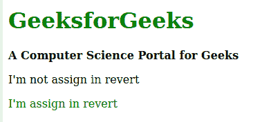

# CSS |还原关键词

> 原文:[https://www.geeksforgeeks.org/css-revert-keyword/](https://www.geeksforgeeks.org/css-revert-keyword/)

**CSS 恢复**关键字是 CSS 中的一个内置关键字，用于将层叠样式恢复到其父元素。如果任何相似的元素拥有相同的层叠样式，但是一个子元素拥有 revert 关键字，则层叠样式将被移除，并将从父元素继承层叠。

**语法:**

```
property: revert;
```

以下示例说明了 CSS 中的 **revert** 关键字:
**示例:**

```
<!DOCTYPE html>
<html>
    <head>
        <title>CSS revert keyword</title>
        <style>
            /* Color for all the child in parent element */
            div {
                color: green;
            }

            /* Specific b and p element color */
            b, p {
                color: black;
            }

            /* Performing revert for child /*
            .rvt {
                color: revert;
            }
        </style>
    </head>
    <body>

        <!-- Parent elements -->
        <div class="container">

            <!-- Child elements -->
            <h1>GeeksforGeeks</h1>
            <b>A Computer Science Portal for Geeks</b>
            <p>I'm not assign in revert</p>
            <p class="rvt">I'm assign in revert</p>
        </div>
    </body>
</html>
```

**输出:**


**支持的浏览器:**CSS revert 关键字支持的浏览器如下:

*   Mozilla Firefox
*   互联网浏览器/微软边缘