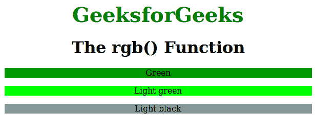

# CSS | rgb()函数

> 原文:[https://www.geeksforgeeks.org/css-rgb-function/](https://www.geeksforgeeks.org/css-rgb-function/)

rgb()函数是 CSS 中的一个内置函数，用于使用红绿蓝模型定义颜色。

**语法:**

```html
rgb( red, green, blue )
```

**参数:**该功能接受三个参数，如上所述，描述如下:

*   **红色:**此参数用于定义红色的强度。它是介于 0 到 255 之间的整数值，或者是介于 0%到 100%之间的百分比值。
*   **绿色:**此参数用于定义绿色的强度。它是介于 0 到 255 之间的整数值，或者是介于 0%到 100%之间的百分比值。
*   **蓝色:**此参数用于定义蓝色的强度。它是介于 0 到 255 之间的整数值，或者是介于 0%到 100%之间的百分比值。

下面的程序说明了 CSS 中的 rgb()函数:

**程序:**

```html
<!DOCTYPE html>
<html>
    <head>
        <title>rgb function</title>
        <style> 
            .gfg1 {
                background-color:rgb(1, 153, 0);
                text-align:center;
            }
            .gfg2 {
                background-color:rgb(0, 255, 0);
                text-align:center
            }
            .gfg3 {
                background-color:rgb(133, 150, 150);
                text-align:center
            }
            .gfg {
                font-size:40px;
                font-weight:bold;
                color:green;
                text-align:center;
            }
            h1 {
                text-align:center;
            }
        </style>
    </head>
    <body>
        <div class = "gfg">GeeksforGeeks</div>
        <h1>The rgb() Function</h1>
        <p class = "gfg1">Green</p>
        <p class = "gfg2">Light green</p>
        <p class = "gfg3">Light black</p>
    </body>
</html>                    
```

**输出:**


**支持的浏览器:**RGB()函数支持的浏览器如下:

*   Chrome 1.0 及以上版本
*   Internet Explorer 4.0 及以上版本
*   Firefox 1.0 及以上版本
*   Safari 1.0 及以上版本
*   Opera 3.5 及以上