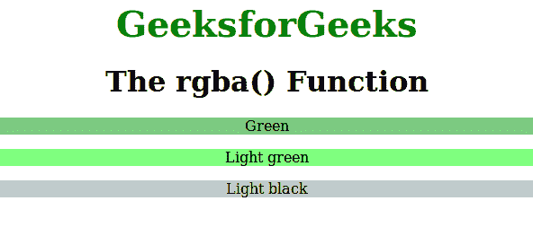

# CSS rgba()函数

> 原文:[https://www.geeksforgeeks.org/css-rgba-function/](https://www.geeksforgeeks.org/css-rgba-function/)

**rgba()函数**是 CSS 中的一个内置函数，用于使用红-绿-蓝-阿尔法(rgba)模型定义颜色。它是 [rgb()](https://www.geeksforgeeks.org/css-rgb-function/) 颜色值的扩展，包含指定颜色透明度的 alpha 通道。

**语法:**

```css
rgba( red, green, blue, alpha )
```

**参数:**该功能接受如下所述的 4 个参数:

*   **红色:**此参数用于定义红色的强度。它是一个介于 0 到 255 之间的整数值，或者是介于 0%到 100%之间的百分比值。
*   **绿色:**此参数用于定义绿色的强度。它是一个介于 0 到 255 之间的整数值，或者是介于 0%到 100%之间的百分比值。
*   **蓝色:**此参数用于定义蓝色的强度。它是一个介于 0 到 255 之间的整数值，或者是介于 0%到 100%之间的百分比值。
*   **alpha:** 此参数用于定义不透明度，值介于 0.0(完全透明)到 1.0(完全不透明)之间。

**示例:**本示例说明了 **rgba()** 函数中不同的颜色强度(即。，红色，蓝色&绿色)，显示每种颜色的特定值，以及用于设置颜色不透明度的 alpha 值。

## 超文本标记语言

```css
<!DOCTYPE html>
<html>
<head>
    <title>rgba function</title>
    <style>
    .gfg1 {
        background-color: rgba(1, 153, 0, 0.5);
        text-align: center;
    }

    .gfg2 {
        background-color: rgba(0, 255, 0, 0.5);
        text-align: center
    }

    .gfg3 {
        background-color: rgba(133, 150, 150, 0.5);
        text-align: center
    }

    .gfg {
        font-size: 40px;
        font-weight: bold;
        color: green;
        text-align: center;
    }

    h1 {
        text-align: center;
    }
    </style>
</head>

<body>
    <div class="gfg">GeeksforGeeks</div>
    <h1>The rgba() Function</h1>
    <p class="gfg1">Green</p>

    <p class="gfg2">Light green</p>

    <p class="gfg3">Light black</p>

</body>
</html>
```

**输出:**



**支持的浏览器:**以下是 **rgba()** 功能支持的浏览器:

*   Chrome 1.0
*   Edge 12.0
*   Internet Explorer 9.0
*   Firefox 3.0
*   Safari 3.1
*   opera10.0