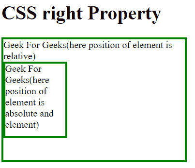
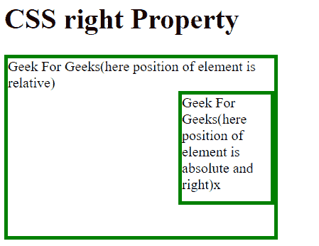
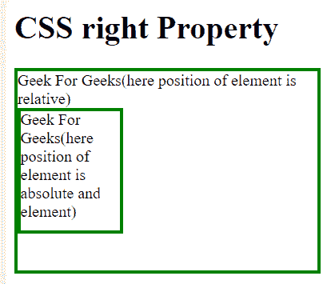

# CSS |产权

> 原文:[https://www.geeksforgeeks.org/css-right-property/](https://www.geeksforgeeks.org/css-right-property/)

css right 属性主要影响元素的水平位置，css 属性对未定位的元素没有影响。
**语法:**

```css
right: auto|length|initial|inherit;
```

**属性值:**

*   **auto:** This is a default property in which browser will calculate the right edge position.
    **Syntax:**

    ```css
    right:auto;
    ```

    **示例-1:**

    ```css
    <!Doctype html>
    <html>

    <head>
        <title>
            CSS | right Property
        </title>
        <style>
            div.geek {
                position: relative;
                width: 300px;
                height: 200px;
                border: 3px solid green;
            }

            div.geeks {
                position: absolute;
                <!-- "auto" right property--> 
                right: auto;
                width: 100px;
                height: 120px;
                border: 3px solid green;
            }
        </style>
    </head>

    <body>

        <h1>CSS right Property</h1>

        <div class="geek">
          Geek For Geeks(here position of element is relative)
        <div class="geeks">
          Geek For Geeks
         (here position of element is absolute and element)
        </div></div>

    </body>

    </html>
    ```

    **输出:**
    

    *   **length:** Length help to set the right edge position of element in px, cm. It should always have positive value.

    **语法:**

    ```css
    right:length;
    ```

    **示例-2:**

    ```css
    <!Doctype html>
    <html>

    <head>
        <title>
            CSS | right Property
        </title>
        <style>
            div.geek {
                position: relative;
                width: 300px;
                height: 200px;
                border: 3px solid green;
            }

            div.geeks {
                position: absolute;
                <!-- "length" right property>
                right: 0px;
                width: 100px;
                height: 120px;
                border: 3px solid green;
            }
        </style>
    </head>

    <body>

        <h1>CSS right Property</h1>

        <div class="geek">
          Geek For Geeks(here position of element is relative)
          <div class="geeks">
            Geek For Geeks
            (here position of element is absolute and element)
          </div>
         </div>

    </body>

    </html>
    ```

    **输出:**
    

    *   **initial:** Initial keyword is used to set default value of CSS property.

    **语法:**

    ```css
    right:initial;
    ```

    **示例-3:**

    ```css
    <!Doctype html>
    <html>

    <head>
        <title>
            CSS | right Property
        </title>
        <style>
            div.geek {
                position: relative;
                width: 300px;
                height: 200px;
                border: 3px solid green;
            }

            div.geeks {
                position: absolute;
                <!--"initial" right property--> 
                right: initial;
                width: 100px;
                height: 120px;
                border: 3px solid green;
            }
        </style>
    </head>

    <body>

        <h1>CSS right Property</h1>

        <div class="geek">
          Geek For Geeks(here position of element is relative)
          <div class="geeks">
            Geek For Geeks
            (here position of element is absolute and element)
         </div>
      </div>

    </body>

    </html>
    ```

    **输出:**
    

    *   **inherit:** Inherit keyword is also used to set default value of CSS property.Here default value is the set value of previous element.
    **Syntax:**

    ```css
    right:inherit;
    ```

    **示例-4:**

    ```css
    <!Doctype html>
    <html>

    <head>
        <title>
            CSS | right Property
        </title>
        <style>
            div.geek {
                position: relative;
                width: 300px;
                height: 200px;
                border: 3px solid green;
            }

            div.geeks {
                position: absolute;
                <!--"inherit" right property>
                right: inherit;
                width: 100px;
                height: 120px;
                border: 3px solid green;
            }
        </style>
    </head>

    <body>

        <h1>CSS right Property</h1>

        <div class="geek">
          Geek For Geeks(here position of element is relative)
          <div class="geeks">
            Geek For Geeks
            (here position of element is absolute and element)
        </div>
      </div>

    </body>

    </html>
    ```

    **输出:**
    

    **支持的浏览器:**以下是*产权*支持的浏览器:

    *   谷歌 Chrome 1.0
    *   Edge 5.5
    *   Firefox 1.0
    *   Opera 5.0
    *   Safari 1.0