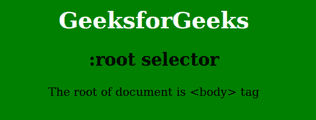

# CSS |:根选择器

> 原文:[https://www.geeksforgeeks.org/css-root-selector/](https://www.geeksforgeeks.org/css-root-selector/)

:根选择器用于选择 HTML 文档的所有元素。这个选择器覆盖了所有的 HTML 元素或标签。

**语法:**

```css
:root {
    // CSS property
} 

```

**示例:**

```css
<!DOCTYPE html>
<html>
    <head>
        <title>root selector</title>
        <style> 
            h1 {
                color:White;
            }
            :root {
                background: green;
            }
            body {
                text-align:center;
            }
        </style>
    </head>
    <body>
        <h1>GeeksforGeeks</h1>
        <h2>:root selector</h2>
        <p>The root of document is <body> tag</p>
    </body>
</html>                    
```

**输出:**


**支持的浏览器:***:根*选择器支持的浏览器如下:

*   苹果 Safari 3.2
*   谷歌 Chrome 4.0
*   Firefox 3.5
*   歌剧 9.6
*   Internet Explorer 9.0