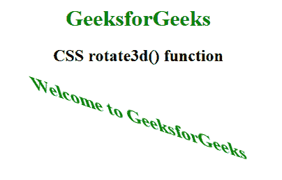

# CSS | rotate3d()函数

> 原文:[https://www.geeksforgeeks.org/css-rotate3d-function/](https://www.geeksforgeeks.org/css-rotate3d-function/)

**rotate3d()函数**是一个内置函数，用于在 3d 空间中围绕固定轴旋转元素。

**语法:**

```
rotate3d( x, y, z, angle )
```

**参数:**该功能接受四个参数，如上所述，描述如下:

*   **x:** 表示 x 坐标的数字。它的值介于 0 到 1 之间。
*   **y:** 表示 y 坐标的数字。它的值介于 0 到 1 之间。
*   **z:** 它包含一个表示 z 坐标的数字。它的值介于 0 到 1 之间。
*   **角度:**保持旋转角度。正角度代表顺时针旋转，负角度代表逆时针旋转。

下面的例子说明了 CSS 中的 rotate3d()函数:

**例 1:**

```
<!DOCTYPE html> 
<html> 
<head> 
    <title>CSS rotate3d() function</title> 
    <style> 
        body {
            text-align:center;
        }
        h1 {
            color:green;
        }
        .rotate3d_image {
            transform: rotate3d(1, 1, 0, 60deg);
        }
    </style> 
</head> 

<body> 
    <h1>GeeksforGeeks</h1>
    <h2>CSS rotate3d() function</h2>
    <br><br>

     
</body> 
</html>            
```

**输出:**


**例 2:**

```
<!DOCTYPE html> 
<html> 
<head> 
    <title>CSS rotate3d() function</title> 
    <style> 
        body {
            text-align:center;
        }
        h1 {
            color:green;
        }
        .GFG {
            font-size:35px;
            font-weight:bold;
            color:green;
            transform: rotate3d(1, 1, 0, 60deg);
        }
    </style> 
</head> 

<body> 
    <h1>GeeksforGeeks</h1>
    <h2>CSS rotate3d() function</h2>
    <br><br>

    <div class="GFG">Welcome to GeeksforGeeks</div> 
</body> 
</html>                     
```

**输出:**


**支持的浏览器:**rotate3d()函数支持的浏览器如下:

*   谷歌 Chrome
*   微软公司出品的 web 浏览器
*   火狐浏览器
*   旅行队
*   歌剧