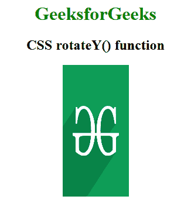

# CSS | rotateY()函数

> 原文:[https://www.geeksforgeeks.org/css-rotatey-function/](https://www.geeksforgeeks.org/css-rotatey-function/)

**rotateY()** 函数是一个内置函数，用于围绕垂直轴旋转元素。

**语法:**

```html
rotateY( angle )
```

**参数:**该功能接受单参数**角度**，代表旋转角度。正负角度分别顺时针和逆时针旋转元素。

以下示例说明了 CSS 中的 **rotateY()函数**:
**示例 1:**

```html
<!DOCTYPE html> 
<html> 
<head> 
    <title>CSS rotateY() function</title> 
    <style> 
        body {
            text-align:center;
        }
        h1 {
            color:green;
        }
        .rotateY_image {
            transform: rotateY(60deg);
        }
    </style> 
</head> 

<body> 
    <h1>GeeksforGeeks</h1>
    <h2>CSS rotateY() function</h2>

     
</body> 
</html>                                  
```

**输出:**


**例 2:**

```html
<!DOCTYPE html> 
<html> 
<head> 
    <title>CSS rotateY() function</title> 
    <style> 
        body {
            text-align:center;
        }
        h1 {
            color:green;
        }
        .GFG {
            font-size:35px;
            font-weight:bold;
            color:green;
            transform: rotateY(60deg);
        }
    </style> 
</head> 

<body> 
    <h1>GeeksforGeeks</h1>
    <h2>CSS rotateY() function</h2>

    <div class="GFG">Welcome to GeeksforGeeks</div> 
</body> 
</html>
```

**输出:**


**支持的浏览器:****rotateY()功能**支持的浏览器如下:

*   谷歌 Chrome
*   微软公司出品的 web 浏览器
*   火狐浏览器
*   旅行队
*   歌剧