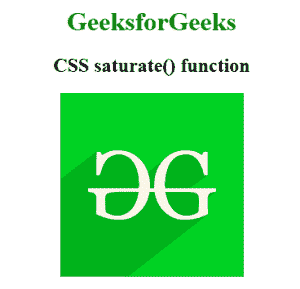

# CSS |饱和()函数

> 原文:[https://www.geeksforgeeks.org/css-saturate-function/](https://www.geeksforgeeks.org/css-saturate-function/)

**饱和()函数**是 CSS 中的一个内置函数，用于对输入图像进行超饱和或去饱和。

**语法:**

```css
saturate( amount )
```

**参数:**该功能接受单参数**金额**，保存折算金额。参数的值是根据数字或百分比设置的。值 0%代表完全不饱和，100%代表完全饱和您可以增加更多的饱和度。

下面的例子说明了 CSS 中的**饱和()函数**:

**示例:**

```css
<!DOCTYPE html>
<html>

<head>
    <title>
      CSS saturate() Function
    </title>

    <style>
        h1 {
            color: green;
        }

        body {
            text-align: center;
        }

        .saturate_effect {
            filter: saturate(250%);
        }
    </style>
</head>

<body>
    <h1>GeeksforGeeks</h1>

    <h4>CSS saturate() function</h4>

    
</body>

</html>
```

**输出:**


**支持的浏览器:***饱和()功能*支持的浏览器如下:

*   谷歌 Chrome
*   微软公司出品的 web 浏览器
*   火狐浏览器
*   歌剧
*   旅行队