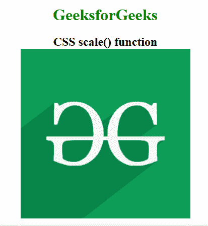
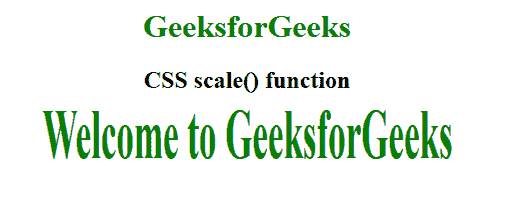

# CSS | scale()函数

> 原文:[https://www.geeksforgeeks.org/css-scale-function/](https://www.geeksforgeeks.org/css-scale-function/)

**scale()函数**是一个内置函数，用于调整 2D 平面中元素的大小。它在水平和垂直方向上缩放元素。

**语法:**

```css
scale( sx )
```

或者

```css
scale( sx, sy )
```

**参数:**

*   **sx:** 在水平面内调整元素大小。
*   **sy:** 在垂直平面调整元素大小。如果未定义 *sy* 的值，则在两个方向(水平和垂直)调整元素 *sx* 的大小。

以下示例说明了 CSS 中的 **scale()函数【T1:
**示例 1:****

```css
<!DOCTYPE html> 
<html> 
<head> 
    <title>CSS scale() function</title> 
    <style> 
        body {
            text-align:center;
        }
        h1 {
            color:green;
        }
        .scale_image {
            transform: scale(1.5);
        }
    </style> 
</head> 

<body> 
    <h1>GeeksforGeeks</h1>
    <h2>CSS scale() function</h2>
    <br><br>
     
</body> 
</html>
```

**输出:**


**例 2:**

```css
<!DOCTYPE html> 
<html> 
<head> 
    <title>CSS scale() function</title> 
    <style> 
        body {
            text-align:center;
        }
        h1 {
            color:green;
        }
        .GFG {
            font-size:35px;
            font-weight:bold;
            color:green;
            transform: scale(1, 2);
        }
    </style> 
</head> 

<body> 
    <h1>GeeksforGeeks</h1>
    <h2>CSS scale() function</h2>

    <div class="GFG">Welcome to GeeksforGeeks</div> 
</body> 
</html>
```

**输出:**


**支持的浏览器:****scale()功能**支持的浏览器如下:

*   谷歌 Chrome
*   微软公司出品的 web 浏览器
*   火狐浏览器
*   旅行队
*   歌剧