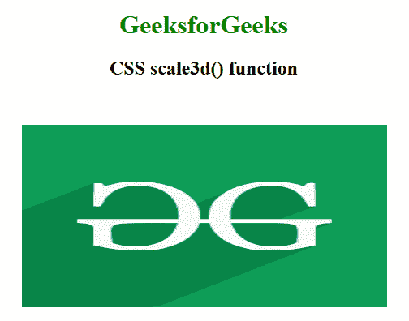
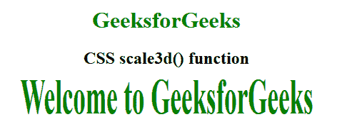

# CSS | scale3d()函数

> 原文:[https://www.geeksforgeeks.org/css-scale3d-function/](https://www.geeksforgeeks.org/css-scale3d-function/)

**scale3d()函数**是一个内置函数，用于在 3d 空间中调整元素的大小。它在 x、y 和 z 平面上缩放元素。

**语法:**

```html
scale3d( sx, sy, sz )
```

**参数:**该功能接受三个参数，如上所述，描述如下:

*   **sx:** 在水平面内调整元素大小。
*   **sy:** 在垂直平面调整元素大小。
*   **sz:** 它调整缩放向量 z 分量中元素的大小。

以下示例说明了 CSS 中的 scale3d()函数:

**例 1:**

```html

<!DOCTYPE html>
<html>

<head>
    <title>CSS scale3d() function</title>

    <style>
        body {
            text-align: center;
        }

        h1 {
            color: green;
        }

        .scale3d_image {
            transform: scale3d(2, 1, 1);
        }
    </style>
</head>

<body>
    <h1>GeeksforGeeks</h1>
    <h2>CSS scale3d() function</h2>

    <br><br>

    
</body>

</html>
```

**输出:**


**例 2:**

```html
<!DOCTYPE html>
<html>

<head>
    <title>CSS scale3d() function</title>

    <style>
        body {
            text-align: center;
        }

        h1 {
            color: green;
        }

        .GFG {
            font-size: 35px;
            font-weight: bold;
            color: green;
            transform: scale3d(1, 2, 1);
        }
    </style>
</head>

<body>
    <h1>GeeksforGeeks</h1>
    <h2>CSS scale3d() function</h2>

    <div class="GFG">Welcome to GeeksforGeeks</div>
</body>

</html>
```

**输出:**


**支持的浏览器:****scale 3d()功能**支持的浏览器如下:

*   谷歌 Chrome
*   微软公司出品的 web 浏览器
*   火狐浏览器
*   歌剧
*   旅行队