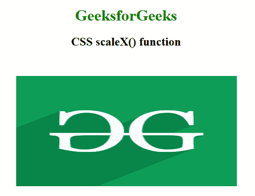

# CSS | scaleX()函数

> 原文:[https://www.geeksforgeeks.org/css-scalex-function/](https://www.geeksforgeeks.org/css-scalex-function/)

scaleX()函数是一个内置函数，用于在 2D 平面中沿 x 轴调整元素的大小。它在水平方向上缩放元素。

**语法:**

```css
scaleX() = scaleX( number )
```

**参数:**该功能接受单个参数**号**，该参数保存沿 x 轴的比例因子。

下面的例子说明了 CSS 中的 scaleX()函数:

**例 1:**

```css
<!DOCTYPE html> 
<html> 

<head> 
    <title>CSS scaleX() function</title> 

    <style> 
        body {
            text-align:center;
        }
        h1 {
            color:green;
        }
        .scaleX_image {
            transform: scaleX(2);
        }
    </style> 
</head> 

<body> 
    <h1>GeeksforGeeks</h1>
    <h2>CSS scaleX() function</h2>

    <br><br>

     
</body> 

</html>
```

**输出:**


**例 2:**

```css
<!DOCTYPE html> 
<html> 

<head> 
    <title>CSS scaleX() function</title> 

    <style> 
        body {
            text-align:center;
        }
        h1 {
            color:green;
        }
        .GFG {
            font-size:35px;
            font-weight:bold;
            color:green;
            transform: scaleX(1.5);
        }
    </style> 
</head> 

<body> 
    <h1>GeeksforGeeks</h1>
    <h2>CSS scaleX() function</h2>

    <div class="GFG">Welcome to GeeksforGeeks</div> 
</body> 

</html>
```

**输出:**


**支持的浏览器:****scaleX()函数**支持的浏览器如下:

*   谷歌 Chrome
*   微软公司出品的 web 浏览器
*   火狐浏览器
*   歌剧
*   旅行队