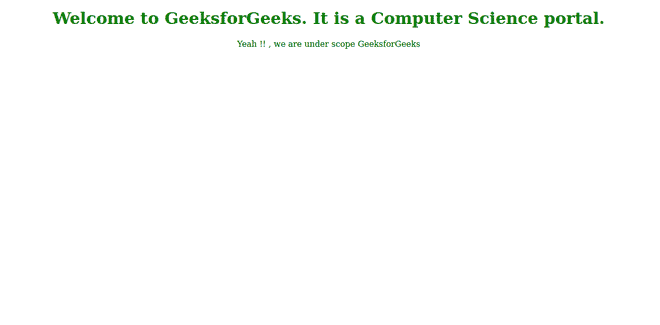
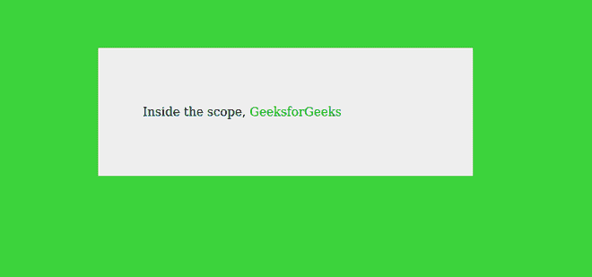

# CSS:作用域伪类

> 原文:[https://www.geeksforgeeks.org/css-scope-pseudo-class/](https://www.geeksforgeeks.org/css-scope-pseudo-class/)

范围元素形成样式块的上下文。该元素为匹配的选择器提供了一个参考点。使用作用域属性定义作用域元素。用作用域属性声明的样式将应用于其父元素中的所有元素。

**语法:**

```css
:scope
```

**例 1:**

```css
<!DOCTYPE html>
<html>
  <title>GeeksforGeeks</title>
  <body>
   <h1 style="text-align: center;
             color: green;" id="paragra">
       Welcome to GeeksforGeeks. 
       It's a Computer Science portal.
   </h1>
   <p style="color: #000; text-align: center;" 
      id="opt">
   </p>
   <script>
     let para = 
        document.getElementById("paragra");
     let opt = 
        document.getElementById("opt");
     if (para.matches(":scope")) {
        opt.innerText = 
        "Yeah!!, we are under scope GeeksforGeeks";
     }
   </script>
  </body>
</html>
```

**输出:**



**例 2:**

```css
<!DOCTYPE html>
<html>
  <head>
    <title>GeeeksforGeeks</title>
     <style>
      #contains {
        margin: 5% auto;
        max-width: 500px;
        background-color: #eeeeee;
      }
      section {
        padding: 60px;
      }
      :scope {
        background-color: #3cd33c;
      }
      </style>
   </head>
  <body>
    <div id="contains">
      <section>
        <p>
          Inside the scope, 
          <span style="color: green;">
                GeeksforGeeks
           </span> 
        </p>
      </section>
    </div>
  </body>
</html>
```

**输出:**



**浏览器支持:**

*   铬
*   火狐浏览器
*   歌剧
*   旅行队
*   边缘