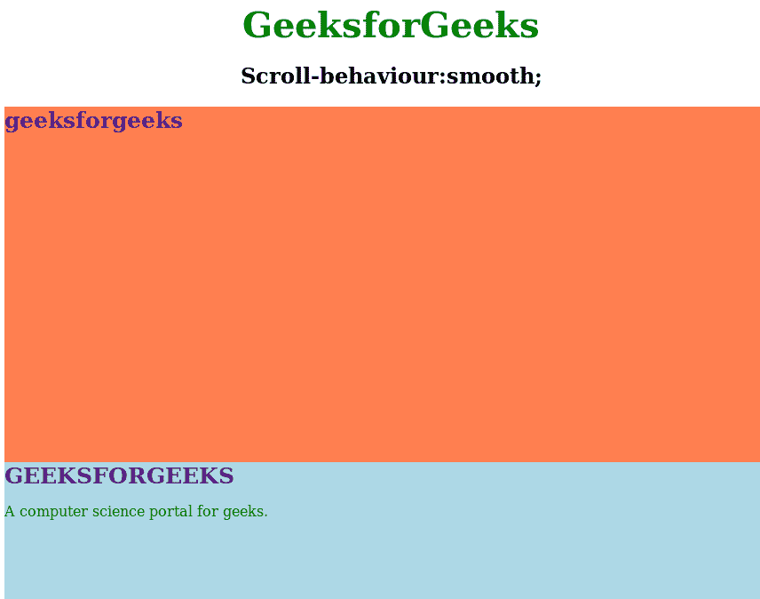
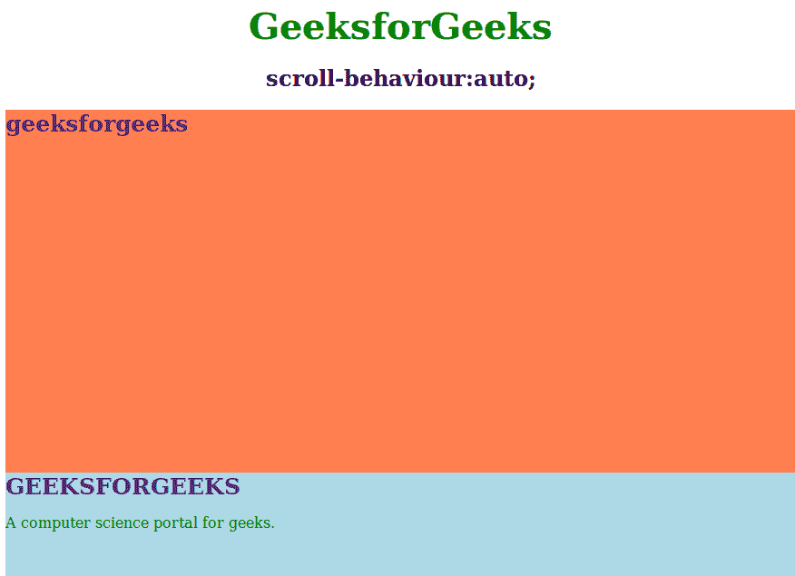

# CSS |滚动行为属性

> 原文:[https://www.geeksforgeeks.org/css-scroll-behavior-property/](https://www.geeksforgeeks.org/css-scroll-behavior-property/)

此属性用于滚动位置的平滑动画，而不是滚动跳转。当用户点击链接时，它会平稳地执行操作。它用于访问可滚动框中的一个链接到另一个链接。

**语法:**

```css
scroll-behavior: auto|smooth|initial|inherit;
```

**默认值:**

*   **自动**

**属性:**

*   **smooth:** This property is used to specify the animation effect of scroll between the elements within the scrollable box.

    **语法:**

    ```css
    scroll-behavior:smooth;
    ```

    **示例:**

    ```css
    <!DOCTYPE html>
    <html>
        <head>
            <title>
                CSS | scroll-behavior Property
            </title>
            <style>
                .g4g {
                    font-size:40px;
                    font-weight:bold;
                    color:green;
                    text-align:center;
                }
                html {
                    scroll-behavior: smooth;
                }

                #geeks {
                    height: 400px;
                    background-color: coral;
                }
                #gfg {
                    height: 400px;
                    background-color: lightblue;
                }
                a {
                    text-decoration:none;
                    font-size:25px;
                    font-weight:bold;
                }
            </style>
        </head>
        <body>
            <div class = "g4g">GeeksforGeeks</div>
            <h2 style="text-align:center;">
              Scroll-behaviour:smooth; 
            </h2>

            <div class="main" id="geeks">
            <a href="#gfg">geeksforgeeks</p>
            </div>

            <div class="main" id="gfg">
            <a href="#geeks">GEEKSFORGEEKS</a>
            <p style="color:green;">
              A computer science portal for geeks.
            </h3> 
            </div>
        </body>
    </html>                    
    ```

    **输出:**
    

*   **auto:** It is used to specify the straight jump scroll effect visit to one link to another link within a scrolling box.

    **语法:**

    ```css
    scroll-behavior:auto;
    ```

    **示例:**

    ```css
    <!DOCTYPE html>
    <html>
        <head>
            <title>
                CSS | scroll-behavior Property
            </title>
            <style>
                .g4g {
                    font-size:40px;
                    font-weight:bold;
                    color:green;
                    text-align:center;
                }
                html {
                    scroll-behavior: auto;
                }

                #geeks {
                    height: 400px;
                    background-color: coral;
                }
                #gfg {
                    height: 400px;
                    background-color: lightblue;
                }
                a {
                    text-decoration:none;
                    font-size:25px;
                    font-weight:bold;
                }
            </style>
        </head>
        <body>
            <div class = "g4g">GeeksforGeeks</div>
            <h2 style="text-align:center;">
             scroll-behaviour:auto;
            </h2>

            <div class="main" id="geeks">
            <a href="#gfg">geeksforgeeks</p>
            </div>

            <div class="main" id="gfg">
            <a href="#geeks">GEEKSFORGEEKS</a>
            <p style="color:green;">
             A computer science portal for geeks.
            </h3> 
            </div>
        </body>
    </html>                    
    ```

    **输出:**
    

**支持的浏览器:***滚动行为属性*支持的浏览器如下:

*   谷歌 Chrome 61.0
*   Firefox 36.0
*   Opera 48.0