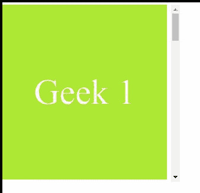

# CSS 滚动-边距-区块-结束属性

> 原文:[https://www . geesforgeks . org/CSS-scroll-margin-block-end-property/](https://www.geeksforgeeks.org/css-scroll-margin-block-end-property/)

**滚动边界块结束**属性用于一次性将所有滚动边界设置到滚动元素的结束侧。此属性定义用于将此框捕捉到捕捉端口的块尺寸末端的滚动捕捉区域的边距。

**语法:**

```css
scroll-margin-block-end: length

/* Or */

scroll-margin-block-end: Global_Values

```

**属性值:**该属性接受上面提到的和下面描述的两个属性:

*   **长度**:该属性是指用 em、px、rem、vh 等长度单位定义的值。
*   **Global_Values:** 该属性是指继承、初始、取消设置等全局值。

**注意:** **滚动-边距-区块-结束**不接受百分比值作为长度。

**示例:**在本例中，您可以通过滚动到示例内容的两个“界面”中间的某个点来查看**滚动-边距-块结束**的效果。

## 超文本标记语言

```css
<!DOCTYPE html>
<html>

<head>
    <style>

        .interfaces {
              width:278px;
              height:296px;
              scroll-snap-align: end none;
              display: flex;
              align-items: center;
              justify-content: center;
              font-size: 60px;
              color: white;
        }
        .doc {
              width: 300px;
              height:300px;
              overflow-x: hidden;
              overflow-y: auto;
              white-space: nowrap;
              scroll-snap-type:y mandatory;
        }

    </style>
</head>

<body>

    <div class="doc">
        <div class="interfaces" style=
              "background-color: rgb(178, 248, 16); 
              scroll-margin-block-end: 90px;">
              Geek 1
        </div>

        <div class="interfaces" style=
              "color: black; 
              scroll-margin-block-end: 90px;">
              Geek 2
        </div>

        <div class="interfaces" style=
              "background-color: green; 
              scroll-margin-block-end: 90px;">
              Geek 3
        </div>

        <div class="interfaces" style=
              "color: green; 
              scroll-margin-block-end: 90px;">
              Geek 4
        </div>

        <div class="interfaces" style=
              "background-color: rgb(34, 177, 34); 
              scroll-margin-block-end: 90px;">
              Geek 5
        </div>

        <div class="interfaces" style=
              "background-color: rgb(108, 216, 162); 
              scroll-margin-block-end: 90px;">
              Geek 6
        </div>
    </div>

</body>

</html>
```

**输出:**本例显示了滚动时 90px 的捕捉区域。



**支持的浏览器:**

*   铬
*   歌剧
*   边缘
*   火狐浏览器