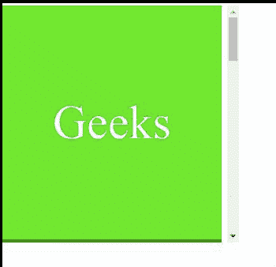

# CSS 滚动-边距-块属性

> 原文:[https://www . geesforgeks . org/CSS-scroll-margin-block-property/](https://www.geeksforgeeks.org/css-scroll-margin-block-property/)

**滚动边距块**属性用于一次将所有滚动边距设置到滚动元素的开始和结束。该属性是**滚动边距块开始**和**滚动边距块结束**属性的简写。

开始侧和结束侧的选择取决于写入模式。开始侧和结束侧分别是水平 tb 写入模式的顶侧和底侧。

*   其中水平-tb 代表从上到下的水平。

开始侧和结束侧分别是垂直-rl 或垂直-lr 写入模式的左侧和右侧。

*   其中垂直-rl 是从右向左的垂直，垂直-lr 是从左向右的垂直。

**语法:**

```css
scroll-margin-block: length
/* Or */
scroll-margin-block: Global_Values

```

**属性值:**滚动边界块属性接受上面提到的和下面描述的两个属性:

*   **长度:**该属性是指用长度单位定义的值，如 em、px、rem、vh 等。
*   **Global_Values:** 该属性是指继承、初始、取消设置等全局值。

**注意:** **滚动-边距-块**不接受百分比值作为长度。

**示例:**在本例中，您可以通过滚动到示例内容的两个“界面”中间的点来查看**滚动边距块**的效果。

```css
<!DOCTYPE html>
<html>
    <head>
        <style>
            .page {
                width: 278px;
                height: 296px;
                box-sizing: border-box;
                color: white;
                font-size: 60px;
                display: flex;
                align-items: center;
                justify-content: center;
                scroll-snap-align: end none;
            }
            .Container {
                width: 300px;
                height: 300px;
                overflow-x: hidden;
                overflow-y: auto;
                white-space: nowrap;
                scroll-snap-type: y mandatory;
            }
        </style>
    </head>
    <body>
        <div class="Container">
            <div class="page" 
                 style="background-color: rgb(95, 236, 14); 
                        scroll-margin-block: 90px;">
                Geeks
            </div>

            <div class="page" 
                 style="background-color: rgb(25, 143, 25);
                        scroll-margin-block: 90px;">
                for
            </div>

            <div class="page" 
                 style="background-color: rgb(110, 228, 129); 
                        scroll-margin-block: 90px;">
                Geeks
            </div>

            <div class="page" 
                 style="color: black; 
                        scroll-margin-block: 90px;">
                for
            </div>

            <div class="page" 
                 style="background-color: rgb(25, 143, 25); 
                        scroll-margin-block: 90px;">
                Geeks
            </div>
        </div>
    </body>
</html>
```

**输出:**



**支持的浏览器:**

*   铬
*   火狐浏览器
*   Safari(不支持)
*   边缘
*   互联网浏览器(不支持)
*   歌剧