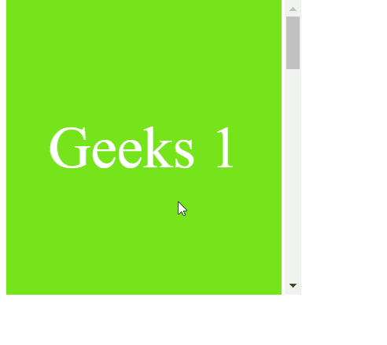

# CSS 滚动-边距-区块-开始属性

> 原文:[https://www . geesforgeks . org/CSS-scroll-margin-block-start-property/](https://www.geeksforgeeks.org/css-scroll-margin-block-start-property/)

**滚动边距块开始**属性用于一次将所有滚动边距设置到滚动元素的开始侧。此属性定义用于将此框捕捉到捕捉端口的块尺寸开始处的滚动捕捉区域的边距。

**语法:**

```
scroll-margin-block-start: length

/* Or */

scroll-margin-block-start: Global_Values

```

**属性值:**该属性接受上面提到的和下面描述的两个属性:

*   **长度:**该属性是指用长度单位定义的值，如 em、px、rem、vh 等。
*   **Global_Values:** 这个属性指的是继承、初始、取消设置等全局值。

**注意:滚动-边距-区块-开始**不接受百分比值作为长度。

**示例:**在本例中，您可以通过滚动到示例内容的两个“界面”中间的某个点来查看**滚动-边距-块-开始**的效果。

## 超文本标记语言

```
<!DOCTYPE html>
<html>

<head>
    <style>
        .interfaces {
            width:280px;
            height:300px;
            scroll-snap-align: start none;
            box-sizing: border-box;
            display: flex;
            align-items: center;
            justify-content: center;
            font-size: 60px;
            color: white;
        }
        .Container {
            width: 300px;
            height:300px;
            overflow-x: hidden;
            overflow-y: auto;
            white-space: nowrap;
            scroll-snap-type: y mandatory;
        }
    </style>
</head>
<body>

    <div class="Container">
        <div class="interfaces" style=
            "background-color: rgb(117, 228, 27); 
            scroll-margin-block-start: 80px;">
            Geeks 1
        </div>

        <div class="interfaces" style=
            "background-color: green; 
            scroll-margin-block-start: 50px;">
            for 2
        </div>

        <div class="interfaces" style=
            "color: black; 
            scroll-margin-block-start: 100px;">
            Geeks 3
        </div>

        <div class="interfaces" 
            style="background-color: rgb(60, 184, 126); 
            scroll-margin-block-start: 80px;">
            for 4
        </div>

        <div class="interfaces" style=
            "background-color: rgb(30, 253, 30); 
            scroll-margin-block-start: 80px;">
            Geeks 5
        </div>
    </div>
</body>

</html>
```

**输出:**



**支持的浏览器:**

*   火狐浏览器
*   铬
*   歌剧
*   边缘