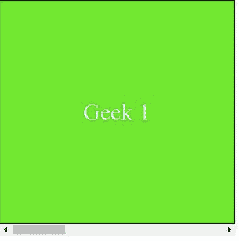

# CSS 滚动-边距-内联属性

> 原文:[https://www . geesforgeks . org/CSS-scroll-margin-inline-property/](https://www.geeksforgeeks.org/css-scroll-margin-inline-property/)

*滚动边距内联*属性用于一次将所有滚动边距设置为滚动元素的开始和结束。该属性是*滚动边距内联开始*和*滚动边距内联结束*属性的简写。开始侧和结束侧的选择取决于写入模式。对于*水平-tb* 写入模式，开始侧和结束侧分别是左侧和右侧。

*   其中*水平-tb* 代表*水平自上而下*。

同样，开始侧和结束侧分别是*垂直-rl* 或*垂直-lr* 写入模式的顶侧和底侧。

*   其中*垂直-rl* 是从右向左的垂直，而*垂直-lr* 是从左向右的*垂直*。

**语法:**

```
scroll-margin-inline: length
```

或者

```
scroll-margin-inline: Global_Values
```

**属性值:***滚动边距内联*属性接受上面提到的和下面描述的两个属性。

*   **长度:**该属性是指用长度单位定义的值，如 *em、px、rem、vh 等。*
*   **Global_Values:** 该属性是指*继承、初始、取消设置、*等全局值。

**注意:***滚动边距内联*不接受百分比值作为长度。

**示例:**在本例中，您可以通过滚动到示例内容的两个界面中间的点来查看*滚动边距内联*的效果。

## 超文本标记语言

```
<!DOCTYPE html>
<html>

<head>
    <style>
        .scroll {
            width: 300px;
            height: 300px;
            overflow-x: scroll;
            display: flex;
            box-sizing: border-box;
            scroll-snap-type: x mandatory;
        }

        .scroll>div {
            flex: 0 0 300px;
            border: 1px solid #000;
            background-color: #57e714;
            color: #fff;
            font-size: 30px;
            display: flex;
            align-items: center;
            justify-content: center;
            scroll-snap-align: end;
        }

        .scroll>div:nth-child(2n) {
            background-color: #fff;
            color: #0fe962;
        }

        .scroll>div:nth-child(2) {
            scroll-margin-inline: 2rem;
        }

        .scroll>div:nth-child(3) {
            scroll-margin-inline: 3rem;
        }
    </style>

</head>

<body>

    <div class="scroll">
        <div>Geek 1</div>
        <div>Geek 2</div>
        <div>Geek 3</div>
        <div>Geek 4</div>
    </div>

</body>

</html>
```

**输出:**



**支持的浏览器:**

*   火狐浏览器
*   Chrome(不支持)
*   边缘(不支持)
*   Safari(不支持)
*   互联网浏览器(不支持)
*   歌剧(不支持)