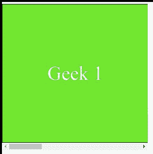

# CSS 滚动-边距-内联-开始属性

> 原文:[https://www . geesforgeks . org/CSS-scroll-margin-inline-start-property/](https://www.geeksforgeeks.org/css-scroll-margin-inline-start-property/)

*滚动边距内联开始*属性用于一次性将所有滚动边距设置为滚动元素的内联尺寸的开始。起始侧的选择取决于写入模式。开始侧分别是*水平-tb* 写入模式的左侧和*垂直-lr* 和*垂直-rl* 写入模式的顶部或底部。
*横-tb* 代表*横从上到下*，*竖-rl* 为*竖从右到左*，*竖-lr* 为*竖从左到右*。

**语法:**

```
 scroll-margin-inline-start: length

```

或者

```
 scroll-margin-inline-start: Global_Values

```

**属性值:****滚动-边距-内联-开始**属性接受上面提到的和下面描述的两个属性。

*   **长度:**该属性是指用长度单位定义的值，如“em”、“px”、“rem”、“vh”等。
*   **Global_Values:** 该属性是指*继承*、*初始*、*取消设置*等全局值。

**注意:***滚动-边距-内联-开始*不接受百分比值作为长度。

**示例:**在本例中，您可以通过滚动到示例内容的两个界面中间的点来查看*滚动-边距-内联-开始*的效果。

## 超文本标记语言

```
<!DOCTYPE html>
<html>

<head>
    <style>
        .scroll {
            width: 300px;
            height: 300px;
            overflow-x: scroll;
            display: flex;
            box-sizing: border-box;
            scroll-snap-type: x mandatory;
        }

        .scroll>div {
            flex: 0 0 300px;
            border: 1px solid #000;
            background-color: #57e714;
            color: #fff;
            font-size: 40px;
            display: flex;
            align-items: center;
            justify-content: center;
            scroll-snap-align: start;
        }

        .scroll>div:nth-child(2n) {
            background-color: #fff;
            color: #0fe962;
        }

        .scroll>div:nth-child(2) {
            scroll-margin-inline-start: 2rem;
        }

        .scroll>div:nth-child(3) {
            scroll-margin-inline-start: 3rem;
        }
    </style>
</head>

<body>
    <div class="scroll">
        <div>Geek 1</div>
        <div>Geek 2</div>
        <div>Geek 3</div>
        <div>Geek 4</div>
    </div>
</body>

</html>
```

**输出:**



**支持的浏览器:**

*   火狐浏览器
*   铬
*   边缘
*   歌剧

**注意:**不支持 Internet Explorer 和 Safari。