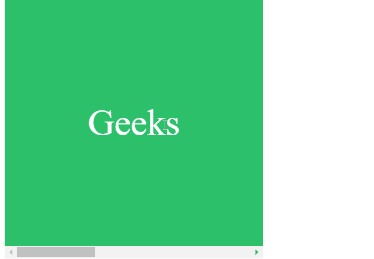

# CSS 滚动边距属性

> 原文:[https://www.geeksforgeeks.org/css-scroll-margin-property/](https://www.geeksforgeeks.org/css-scroll-margin-property/)

**滚动边距**属性用于一次设置一个元素的所有滚动边距。为滚动边距指定的值决定了主要在支持范围之外的页面应该保持可见的程度。

因此，**滚动边界**值代表定义滚动捕捉区域的外接，该区域用于将该框捕捉到支架。

**语法:**

```
scroll-margin: length

/* Or */

scroll-margin: Global_Values

```

**属性值:** 该属性接受  两个属性，如下所述:

*   **长度:**该属性是指用长度单位 exp: px、em、vh 等定义的值。
*   **Global_Values:** 该属性是指继承、初始、取消设置等全局值。

**注意:**滚动边距不接受百分比值作为长度。

**示例:**在本例中，您可以通过滚动到示例内容的两个“界面”中间的某个点来查看滚动边距的效果。

## 超文本标记语言

```
<!DOCTYPE html>
<html lang="en">

<head>
    <meta charset="UTF-8">
    <meta name="viewport" 
          content="width=device-width, 
                  initial-scale=1.0">

    <style>
        .scroll {
            width: 350px;
            height: 350px;
            text-align: left;
            box-sizing: border-box;
            display: flex;
            overflow-x: scroll;
            scroll-snap-type: x mandatory;
        }
        .scroll > div {
            flex: 0 0 350px;
            width: 350px;
            font-size: 50px;
            display: flex;
            align-items: center;
            justify-content: center;
            scroll-snap-align: start;
        }

        /* Scroller will give 2rem margin
           from left */
        .scroll > div:nth-child(even) {
            background-color: rgb(77, 238, 184);
            color: #fff;
            scroll-margin: 2rem;
        }

        /* Scroller will give 5rem margin
           from left */
        .scroll > div:nth-child(odd) {
            background-color: #2dc06a;
            color: #fff;
            scroll-margin: 5rem;
        }
    </style>
</head>

<body>
    <div class="scroll">
        <div>Geeks</div>
        <div>for</div>
        <div>Geeks</div>
    </div>   
</body>

</html>
```

**输出:** 当滚动经过中间的子元素时，滚动将捕捉到偶数子 div 左边缘外的 2 rem ，以及奇数子 div 左边缘外的 3 rem 。



**支持的浏览器:**

*   铬
*   火狐浏览器
*   边缘
*   Safari(部分支持)
*   歌剧