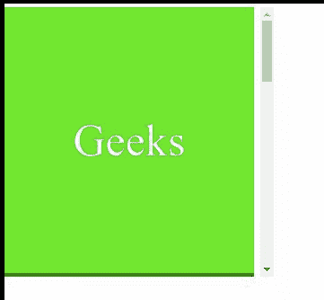

# CSS 滚动-页边距-顶部属性

> 原文:[https://www . geesforgeks . org/CSS-scroll-margin-top-property/](https://www.geeksforgeeks.org/css-scroll-margin-top-property/)

**滚动边距顶部**属性用于一次性将所有滚动边距设置到一个元素的顶部。为**滚动页边距顶部**指定的值决定了主要在支持范围之外的页面应该保持多少可见。

因此，**滚动边界顶端**值代表定义滚动捕捉区域的突出部分，该区域用于将该框捕捉到支架。

**语法:**

```html
scroll-margin-top: length
/* Or */
scroll-margin-top: Global_Values

```

**属性值:**该属性接受上面提到的和下面描述的两个属性:

*   **长度:**该属性是指用长度单位定义的值:px、em、rem、vh 等。
*   **Global_Values:** 该属性是指初始值、继承值、取消设置值等全局值。

**注意:** **滚动-边距-顶部**不接受百分比值作为长度。

**示例:**在本例中，您可以通过滚动到示例内容的两个“界面”中间的点来查看**滚动页边距顶部**的效果。

```html
<!DOCTYPE html>
<html>

  <head>
    <style>
          .page {
                width:278px;
                height:296px;
                color: white;
                font-size: 50px;
                display: flex;
                box-sizing: border-box;
                align-items: center;
                justify-content: center;
                scroll-snap-align: end none;
          }
          .Container {
                width: 300px;
                height:300px;
                overflow-x: hidden;
                overflow-y: auto;
                white-space: nowrap;
                scroll-snap-type:y mandatory;
          }
    </style>

  </head>
  <body>

    <div class="Container">

          <div class="page" style=
               "background-color: rgb(20, 240, 38); 
                scroll-margin-top: 0px;">
                   Geeks
            </div>

          <div class="page" style=
               "background-color: green; 
                scroll-margin-top: 20px;">
                for
          </div>

          <div class="page" 
               style="color: black; 
               scroll-margin-top: 40px;">
                 Geeks
            </div>

          <div class="page" 
               style=
     "background-color: rgb(10, 207, 43); 
               scroll-margin-top: 30px;">
                  for
            </div>
    </div>

  </body>
</html>
```

**输出:**



**支持的浏览器:**

*   铬
*   火狐浏览器
*   歌剧
*   边缘
*   互联网浏览器(不支持)
*   Safari(部分支持)