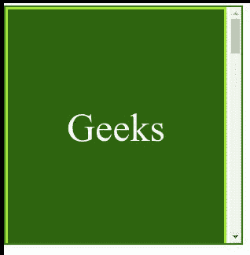

# CSS 滚动-填充-区块-结束属性

> 原文:[https://www . geesforgeks . org/CSS-scroll-padding-block-end-property/](https://www.geeksforgeeks.org/css-scroll-padding-block-end-property/)

*滚动填充块结束*属性用于一次性将所有滚动填充设置到块维度中的滚动容器或元素的末尾。端侧分别是*水平-tb* 书写模式的底侧和垂直 *-rl* 或垂直 *-lr* 书写模式的左侧或右侧。其中*水平-tb* 分别代表*水平自上而下*和垂直 *-rl* 或垂直 *-lr* 分别代表垂直*从右向左*和垂直*从左向右*。

**语法:**

```
scroll-padding-block-end: keyword_values
```

或者

```
scroll-padding-block-end: length_values
```

或者

```
scroll-padding-block-end: Global_Values
```

**属性值:**该属性接受上面提到的和下面描述的三个属性。

*   **length_values:** 该属性是指用长度单位定义的值。例: *px、em、vh、%* 等。
*   **关键字 _ 值:**该属性是指用 auto 等单位定义的关键字 _ 值。一般来说，默认情况下这将被设置为 0px，但如果非零值更合适，它也可以是非零值。
*   **Global_Values:** 该属性是指*继承、初始、取消设置*等全局值。

**示例:**在本例中，您可以通过滚动到示例内容的两个界面中间的点来查看*滚动-填充-块结束*属性的效果。

## 超文本标记语言

```
<!DOCTYPE html>
<html>

<head>
    <style>
        .geek {
            width: 275px;
            height: 300px;
            border: solid greenyellow;
            color: white;
            display: flex;
            justify-content: center;
            align-items: center;
            font-size: 50px;
            scroll-snap-align: end none;
        }

        .GeeksforGeeks {
            width: 300px;
            height: 300px;
            border: 2px solid green;
            text-align: center;
            overflow-x: hidden;
            overflow-y: auto;
            white-space: nowrap;
            scroll-snap-type: y mandatory;
        }
    </style>
</head>

<body>
    <div class="GeeksforGeeks" style=
        "scroll-padding-block-end: 90px;">

        <div class="geek" style=
            "background-color:darkgreen;">
            Geeks
        </div>

        <div class="geek" style=
            "background-color:rgb(129, 245, 21);">
            for
        </div>

        <div class="geek" style="color:green;">
            Geeks
        </div>

        <div class="geek" style=
            "background-color:rgb(115, 223, 43);">
            for
        </div>

        <div class="geek" style="color: green;">
            Geeks
        </div>

        <div class="geek" style="color:black;">
            for
        </div>
    </div>

</body>

</html>
```

**输出:**



**支持的浏览器:**

*   铬
*   火狐浏览器
*   Safari(不支持)
*   边缘
*   歌剧
*   互联网浏览器(不支持)