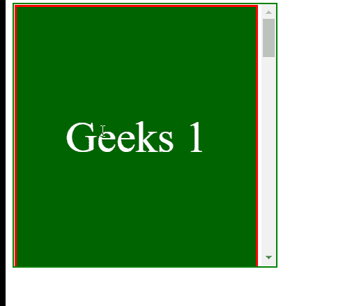

# CSS 滚动填充块属性

> 原文:[https://www . geesforgeks . org/CSS-scroll-padding-block-property/](https://www.geeksforgeeks.org/css-scroll-padding-block-property/)

**滚动填充块**属性用于一次性将所有滚动填充设置到块维度中滚动容器或元素的开始和结束。该属性是**滚动填充块开始**和**滚动填充块结束**属性的简写。

因此， **滚动填充** 值代表定义滚动捕捉区域的突出部分，该区域用于将框捕捉到捕捉端口。

**语法:**

```
scroll-padding-block: keyword_values

/* Or */

scroll-padding-block: length_values

/* Or */

scroll-padding-block: Global_Values

```

**属性值:**该属性接受上面提到的和下面描述的三个属性:

*   **length_values** :该属性是指用长度单位定义的值。例如:px、em、vh 等。
*   **关键字 _ 值:**该属性是指用 auto 等单位定义的关键字 _ 值。一般来说，默认情况下这将设置为 0px，但如果非零值更合适，它也可以是非零值。
*   **Global_Values:** 该属性是指*继承、初始、取消设置、*等全局值。

**示例:**在本例中，您可以通过滚动到示例内容的两个“界面”中间的点来查看**滚动填充块**的效果。

## 超文本标记语言

```
<!DOCTYPE html>
<html>

<head>
    <style>
        .geek {
              width: 275px;
              height:300px;
              border: solid red;
              color: white;
              display: flex;
              justify-content: center;
              align-items: center;
              font-size: 50px;
              scroll-snap-align: start none;
        }

        .GeeksforGeeks {
              width: 300px;
              height:300px;
              border: 2px solid green;
              overflow-x: hidden;
              overflow-y: auto;
              white-space: nowrap;
              scroll-snap-type: y mandatory;
        }
    </style>
</head>

<body>
    <div class="GeeksforGeeks" 
        style="scroll-padding-block: 20px;">
        <div class="geek" style=
              "background-color:darkgreen;">
               Geeks 1
        </div>

        <div class="geek" style=
              "background-color:rgb(129, 245, 21);">
               for 1
        </div>

        <div class="geek" style=
              "color:green;">
               Geeks 2
        </div>

        <div class="geek" style=
              "background-color:rgb(115, 223, 43);">
               for 2
        </div>

        <div class="geek" style=
              "color: green;">
               Geeks 3
        </div>

        <div class="geek" style=
              "color:black;">
               for 3
        </div>
    </div>
</body>

</html>
```

**输出:**



**支持的浏览器:**

*   铬
*   火狐浏览器
*   边缘
*   歌剧