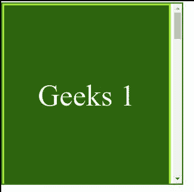

# CSS 滚动-填充-区块-开始属性

> 原文:[https://www . geesforgeks . org/CSS-scroll-padding-block-start-property/](https://www.geeksforgeeks.org/css-scroll-padding-block-start-property/)

*滚动填充块开始*属性用于一次性将所有滚动填充设置到块维度中滚动容器或元素的开始处。起始侧分别是*水平-tb* 写入模式的顶侧和*垂直-rl* 或*垂直-lr* 写入模式的右侧或左侧。其中*水平-tb* 分别代表*水平上下*和垂直 *-rl* 或垂直 *-lr* 分别代表垂直*左右*和垂直*左右*。

**语法:**

```css
scroll-padding-block-start: keyword_values
```

或者

```css
scroll-padding-block-start: length_values
```

或者

```css
scroll-padding-block-start: Global_Values
```

**属性值:**该属性接受上面提到的和下面描述的三个属性。

*   **length_values:** 该属性是指用长度单位 exp 定义的值: *px，em，vh，%* 等。
*   **关键字 _ 值:**该属性是指用*汽车*等单位定义的关键字值。一般来说，默认情况下这将被设置为 0px，但如果非零值更合适，它也可以是非零值。
*   **Global_Values:** 该属性是指*继承*、*初始*、*取消设置*等全局值。

**示例:**在本例中，您可以通过滚动到示例内容的两个界面中间的点来查看*滚动-填充-块-开始*的效果。

## 超文本标记语言

```css
<!DOCTYPE html>
<html>

<head>
    <style>
        .geek {
            width: 275px;
            height: 300px;
            border: solid red;
            color: white;
            display: flex;
            justify-content: center;
            align-items: center;
            font-size: 50px;
            scroll-snap-align: start none;
        }

        .GeeksforGeeks {
            width: 300px;
            height: 300px;
            border: 2px solid green;
            text-align: center;
            overflow-x: hidden;
            overflow-y: auto;
            white-space: nowrap;
            scroll-snap-type: y mandatory;
        }
    </style>
</head>

<body>
    <div class="GeeksforGeeks"
        style="scroll-padding-block-start: 90px;">

        <div class="geek" style=
            "background-color:darkgreen;">
            Geeks 1
        </div>
        <div class="geek" style=
            "background-color:rgb(129, 245, 21);">
            for 1
        </div>
        <div class="geek" style="color:green;">
            Geeks 2
        </div>
        <div class="geek" style=
            "background-color:rgb(115, 223, 43);">
            for 2
        </div>
        <div class="geek" style="color: green;">
            Geeks 3
        </div>
        <div class="geek" style="color:black;">
            for 3
        </div>
    </div>
</body>

</html>
```

**输出:**



**支持的浏览器:**

*   互联网浏览器(不支持)
*   歌剧
*   Safari(不支持)
*   铬
*   边缘
*   火狐浏览器