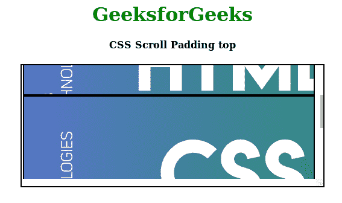

# CSS |滚动填充顶部

> 原文:[https://www.geeksforgeeks.org/css-scroll-padding-top/](https://www.geeksforgeeks.org/css-scroll-padding-top/)

**滚动填充顶部**是滚动捕捉模块中的一个内置属性。此属性设置滚动填充顶部长字符。这个属性就像滑动元素顶部的一块磁铁，它会粘在视图端口的顶部，并在那个地方(强制地)停止滚动。

滚动填充属性是可选的，当[滚动捕捉类型属性](https://www.geeksforgeeks.org/css-scroll-snap-type/)设置为无时使用该属性。

**语法:**

```css
scroll-padding-top: [  length percentage | auto ]
```

**属性值:**该属性接受上面提到和下面描述的两个属性:

*   **长度-百分比:**该属性的工作原理与其他填充属性相同，该属性包含任何特定填充单位的长度。
*   **auto:** 该属性为浏览器确定的填充留出一些空间。

**示例:**以下示例说明了滚动填充顶部属性:

```css
<!DOCTYPE html> 
<html> 

<head> 
    <title> 
        CSS Scroll Padding top
    </title> 
    <style> 
        h1 { 
            color: green; 
        }
        .element{
            border:2px solid black;
        }

        .container { 
            width: 500px; 
            height: 200px; 
            margin-left: auto; 
            margin-right: auto; 
            border: 2px solid black; 
            overflow: scroll; 
            position: relative; 
        } 

        .element { 
            width: 480px; 
            height: 180px; 
            scroll-snap-align: start; 
            scroll-snap-stop: normal; 
            color: white; 
            font-size: 50px; 
            display: flex; 
            justify-content: center; 
            align-items: center; 
        } 

        .y-mandatory { 
            scroll-snap-type: y mandatory;
                        /* scroll-padding: top right bottom left */ 
            scroll-padding-top: 50px;
        } 

        .element:nth-child(1) { 
            background: 
url("https://www.geeksforgeeks.org/wp-content/uploads/html-768x256.png"); 
        } 

        .element:nth-child(2) { 
            background: 
url("https://www.geeksforgeeks.org/wp-content/uploads/CSS-768x256.png"); 
        } 

        .element:nth-child(3) { 
            background: 
url("https://www.geeksforgeeks.org/wp-content/uploads/javascript-768x256.png"); 
        } 
    </style> 
</head> 

<body> 
    <center> 
        <h1>GeeksforGeeks</h1> 
        <h4>CSS Scroll Padding top</h4> 
        <div class="container y-scroll y-mandatory"> 
            <div class="wrapper"> 
                <div class="element"></div> 
                <div class="element"></div> 
                <div class="element"></div> 
            </div> 
        </div> 
    </center> 
</body> 

</html>                     

```

**输出:**


**支持的浏览器:****CSS 滚动填充顶端**支持的浏览器如下:

*   谷歌 Chrome 69
*   Internet Explorer 11
*   Firefox 68
*   Safari 11