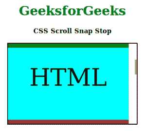

# CSS |滚动捕捉停止

> 原文:[https://www.geeksforgeeks.org/css-scroll-snap-stop/](https://www.geeksforgeeks.org/css-scroll-snap-stop/)

**滚动捕捉停止**属性是滚动捕捉模块中的一个内置属性。“滚动捕捉停止”属性停止，或者您可以将滚动锁定在您定义的特定位置。它的工作原理就像你的每张幻灯片中都有一个图案，当用户滚动幻灯片时，图案会自动改变并适合背景，并固定内容的位置。它是滚动快照模块中的可选属性。

**滚动捕捉停止**属性允许开发者在特定位置停止用户滚动动作。假设用户通过滚轮的巨大滚动来滚动页面，那么通常滚动将在滚动点结束时停止，此时该页面上没有可访问的内容。但是有了这个属性，开发者告诉浏览器在哪里停下来并不重要，不管滚动有多大。

**语法:**

```
scroll-snap-stop: normal | always;
```

**参数:**该属性只接受上面提到的和下面描述的两个参数:

*   **正常:**该属性为默认值。浏览器通过捕捉位置时不会停止任何特定位置。
*   **始终:**该属性启用捕捉位置的停止。

**示例:**以下示例说明了滚动捕捉停止属性:

## 超文本标记语言

```
<!DOCTYPE html>
<html>

<head>
    <title>
        CSS Scroll Snap Stop
    </title>
    <style>
        h1 {
            color: green;
        }

        .container {
            display: flex;
            overflow: auto;
            outline: 2px solid black;
            flex: none;
        }

        .container.y {
            width: 320px;
            height: 200px;
            flex-flow: column nowrap;
        }

        .container > div {
            text-align: center;
            scroll-snap-align: center;
            flex: none;
        }

        .y.container > div {
            line-height: 150px;
            font-size: 60px;
            width: 300px;
            height: 180px;
        }

        .y.proximity-scroll-snapping {
            scroll-snap-type: y proximity;
        }
        .proximity-scroll-snapping > div {
             scroll-snap-stop: always;
        }
    </style>
</head>

<body>
    <center>
        <h1>GeeksforGeeks</h1>
        <h4>CSS Scroll Snap Stop</h4>
        <div class="container y proximity-scroll-snapping">
            <div style="background:green;">Geeks</div>
            <div style="background:cyan;">HTML</div>
            <div style="background:brown;">CSS</div>
            <div style="background:purple;">JavaScript</div>
            <div style="background:yellow;">Bootstrap</div>
        </div>
    </center>
</body>

</html>                   
```

**输出:**



**支持的浏览器:****CSS 滚动快照停止**支持的浏览器如下:

*   谷歌 Chrome 69
*   Internet Explorer 11
*   Firefox 68
*   Safari 11