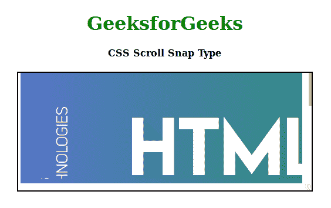

# CSS |滚动捕捉类型

> 原文:[https://www.geeksforgeeks.org/css-scroll-snap-type/](https://www.geeksforgeeks.org/css-scroll-snap-type/)

**滚动捕捉类型**属性是滚动捕捉模块中的内置属性。如果没有“滚动快照”模块，图像库看起来会很可笑。在滚动快照模块之前，这种效果可以通过 JavaScript 来实现，但是在这段时间里，可以通过 CSS 来实现滚动快照。

此属性对于在页面的某个特定点停止滚动非常有用。您可以在网页的图库部分使用此属性。它会让你完全控制滚动。

**语法:**

```html
scroll-snap-type: none | [ x | y | block | inline | both ] [ mandatory | proximity ]

```

**属性值:**该属性使用许多值，如上所述，如下所述:

*   **无:**此属性禁用将忽略捕捉点的滚动捕捉。
*   **x:** 该属性启用沿 x 轴的滚动捕捉，在水平轴的捕捉位置工作。
*   **y:** 该属性启用沿 y 轴的滚动捕捉，在垂直轴的捕捉位置工作。
*   **块:**该属性启用沿块轴的滚动捕捉，该轴作用于块轴的捕捉位置。
*   **内联:**该属性启用沿内联轴的滚动捕捉，该轴作用于内联轴的捕捉位置。
*   **两者:**该属性启用包括 x 轴、y 轴、块轴和内联轴的滚动捕捉。
*   **强制:**此属性启用特定的严格值，当没有滚动时，该值会转到特定的滚动位置。
*   **接近度:**该属性启用特定滚动位置的特定严格值。如果滚动动作非常接近捕捉位置，如果没有接近，那么它将正常工作，根本不应该捕捉。

**示例:**以下示例将说明滚动捕捉类型属性:

```html
<!DOCTYPE html>
<html>

<head>
    <title>
        CSS Scroll Snap Type
    </title>
    <style>
        h1 {
            color: green;
        }

        .container {
            width: 500px;
            height: 200px;
            margin-left: auto;
            margin-right: auto;
            border: 2px solid black;
            overflow: scroll;
            position: relative;
        }

        .element {
            width: 480px;
            height: 180px;
            scroll-snap-align: start;
            scroll-snap-stop: normal;
            color: white;
            font-size: 50px;
            display: flex;
            justify-content: center;
            align-items: center;
        }

        .y-mandatory {
            scroll-snap-type: y mandatory;
        }

        .element:nth-child(1) {
            background:
url("https://www.geeksforgeeks.org/wp-content/uploads/html-768x256.png");
        }

        .element:nth-child(2) {
            background: 
url("https://www.geeksforgeeks.org/wp-content/uploads/CSS-768x256.png");
        }

        .element:nth-child(3) {
            background: 
url("https://www.geeksforgeeks.org/wp-content/uploads/javascript-768x256.png");
        }
    </style>
</head>

<body>
    <center>
        <h1>GeeksforGeeks</h1>
        <h4>CSS Scroll Snap Type</h4>
        <div class="container y-scroll y-mandatory">
            <div class="wrapper">
                <div class="element"></div>
                <div class="element"></div>
                <div class="element"></div>
            </div>
        </div>
    </center>
</body>

</html>                    
```

**输出:**


**支持的浏览器:****滚动捕捉类型**支持的浏览器如下:

*   谷歌 Chrome 69
*   Internet Explorer 11
*   Firefox 68
*   Safari 11