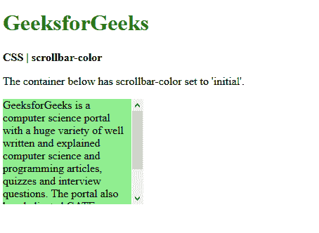

# CSS |滚动条-颜色属性

> 原文:[https://www.geeksforgeeks.org/css-scrollbar-color-property/](https://www.geeksforgeeks.org/css-scrollbar-color-property/)

**滚动条颜色**属性用于设置元素滚动条的颜色。它可以用来分别控制滚动条轨道和滚动条滑块颜色。
滚动条的轨迹是滚动条的背景，它保持不变并显示可滚动的区域。滚动条的大拇指指的是浮动在轨道顶部的滚动条的移动部分，表示滚动条的当前位置。

**语法:**

```css
scrollbar-color: auto | color | dark | light | initial | inherit
```

**属性值:**

*   **auto:** It is used to set the scrollbar color to be automatically set by the browser. It is the default value and provides the browser default colors for rendering the scrollbar.

    **示例:**

    ```css
    <!DOCTYPE html>
    <html>
    <head>
      <title>
        CSS | scrollbar-color
      </title>
      <style>
        .scrollbar-auto {
          scrollbar-color: auto;

          height: 150px;
          width: 200px;
          overflow-y: scroll;
          background-color: lightgreen;
        }
      </style>
    </head>
    <body>
      <h1 style="color: green">
        GeeksforGeeks
      </h1>
      <b>
        CSS | scrollbar-color
      </b>
      <p>
        The container below has
        scrollbar-color set to 
        'auto'.
      </p>
      <div class="scrollbar-auto">
        GeeksforGeeks is a computer science
        portal with a huge variety of well
        written and explained computer science
        and programming articles, quizzes and
        interview questions. The portal also
        has dedicated GATE preparation and
        competitive programming sections.
      </div>
    </body>
    </html>
    ```

    **输出:**
    

*   **color:** It is used to set the scrollbar color to any custom color. It takes two values, the first is applied to the scrollbar thumb and the second color is applied to the scrollbar track.

    **示例:**

    ```css
    <!DOCTYPE html>
    <html>
    <head>
      <title>
        CSS | scrollbar-color
      </title>
      <style>
        .scrollbar-colored {
          scrollbar-color: red green;

          height: 150px;
          width: 200px;
          overflow-y: scroll;
          background-color: lightgreen; 
        }
      </style>
    </head>
    <body>
      <h1 style="color: green">
        GeeksforGeeks
      </h1>
      <b>
        CSS | scrollbar-color
      </b>
      <p>
        The container below has a
        red green scrollbar-color.
      </p>
      <div class="scrollbar-colored">
        GeeksforGeeks is a computer science
        portal with a huge variety of well
        written and explained computer science
        and programming articles, quizzes and
        interview questions. The portal also
        has dedicated GATE preparation and
        competitive programming sections.
      </div>
    </body>
    </html>
    ```

    **输出:**
    

*   **light:** 它用于提供滚动条的更亮的变体，可以基于默认颜色或自定义颜色。该属性在所有主要浏览器上都已停止使用。
*   **dark:** It is used to provide a darker variant of the scrollbar which can be based on the default colors or a custom one. This property has been discontinued on all major browsers.
*   **initial:** It is used to set the color to its default value.

    **示例:**

    ```css
    <!DOCTYPE html>
    <html>
    <head>
      <title>
        CSS | scrollbar-color
      </title>
      <style>
        .scrollbar-initial {
          scrollbar-color: initial;

          height: 150px;
          width: 200px;
          overflow-y: scroll;
          background-color: lightgreen;
        }
      </style>
    </head>
    <body>
      <h1 style="color: green">
        GeeksforGeeks
      </h1>
      <b>
        CSS | scrollbar-color
      </b>
      <p>
       The container below has
       scrollbar-color set to
       'initial'.
      </p>
      <div class="scrollbar-initial">
        GeeksforGeeks is a computer science
        portal with a huge variety of well
        written and explained computer science
        and programming articles, quizzes and
        interview questions. The portal also
        has dedicated GATE preparation and
        competitive programming sections.
      </div>
    </body>
    </html>
    ```

    **输出:**
    

*   **继承:**用于从其父代继承颜色。

    **示例:**

    ```css
    <!DOCTYPE html>
    <html>
    <head>
      <title>
        CSS | scrollbar-color
      </title>
      <style>
        .scrollbar-colored {
          scrollbar-color: green blue;

          height: 150px;
          width: 200px;
          overflow-y: scroll;
          background-color: lightgreen;
        }

        .scrollbar-inherit {
          scrollbar-color: inherit;

          height: 75px;
          width: 100px;
          overflow-y: scroll;
        }
      </style>
    </head>
    <body>
      <h1 style="color: green">
        GeeksforGeeks
      </h1>
      <b>
        CSS | scrollbar-color
      </b>
      <p>
        The container below has
        a scrollable child element
        that inherits the parent's
        scrollbar color.
      </p>
      <div class="scrollbar-colored">
        <div class="scrollbar-inherit">
          This scrollbar color is inherited
          from the parent.
        </div>
        GeeksforGeeks is a computer science
        portal with a huge variety of well
        written and explained computer science
        and programming articles, quizzes and
        interview questions. The portal also
        has dedicated GATE preparation and
        competitive programming sections.
      </div>
    </body>
    </html>
    ```

    **输出:**
    

**支持的浏览器:**滚动条颜色属性支持的浏览器如下:

*   Firefox 64